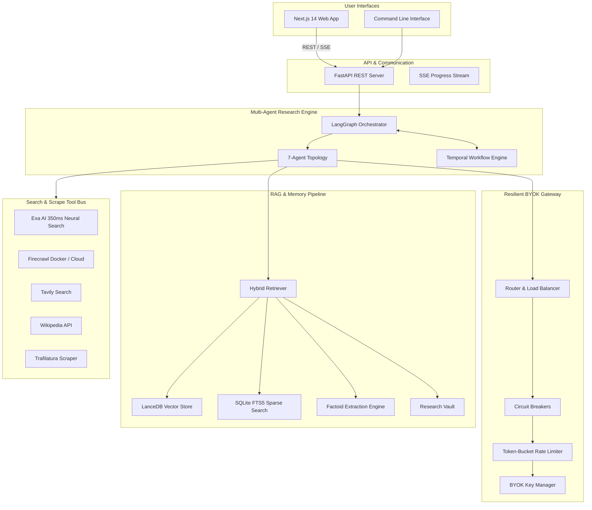
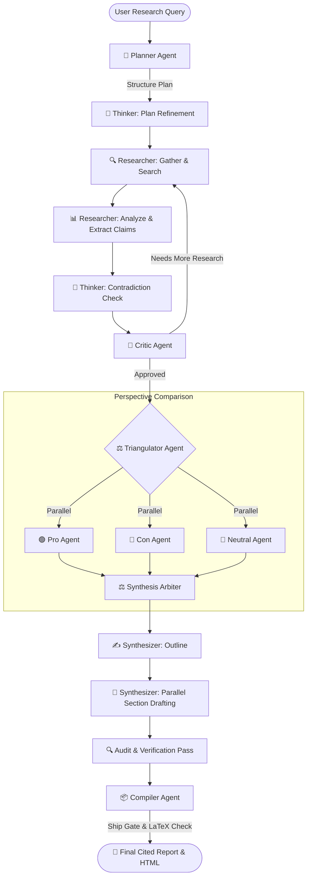

<div align="center">

# 🌐 Autonomous Research Agent

### *Open-Source Multi-Agent Deep Research Engine powered by LangGraph, Temporal & Resilient LLM Gateway*

[](https://opensource.org/licenses/MIT)
[](https://python.org)
[](https://github.com/langchain-ai/langgraph)
[](https://temporal.io)
[](https://nextjs.org)
[](https://exa.ai)

---

**Autonomous Research Agent** is a production-grade multi-agent platform that autonomously plans, searches, verifies, and synthesizes 15,000+ word publication-quality technical research reports with inline verified citations, LaTeX math rendering ($\LaTeX$), ASCII flowcharts, and interactive HTML export.

*Runs out-of-the-box using built-in zero-config free fallbacks or with your own provider keys (Google Gemini, Groq, OpenAI, DeepSeek).*

---

[Key Features](#-key-features) •
[Quick Start](#-quick-start) •
[System Architecture](#-system-architecture) •
[Benchmark Comparison](#-benchmark-comparison) •
[Research Modes](#-research-modes) •
[Documentation](#-documentation)

---

</div>

## 🌟 Key Features

| Feature | Architecture | Purpose |
| :--- | :--- | :--- |
| 🤖 **7-Agent LangGraph Topology** | **Planner**, **Thinker**, **Researcher**, **Critic**, **Triangulator**, **Synthesizer**, & **Compiler**. | Deconstructs complex queries into structured research subtasks with automated gap verification. |
| 🚀 **Parallel Section Synthesis** | Concurrent multi-threaded LLM section drafting with **Audit Verification Pass**. | Drafts 8+ detailed report chapters simultaneously in seconds with 100% full section token allocation. |
| 🌐 **Sub-Second Web Search** | Multi-engine Tool Bus (**Exa AI 350ms Neural Search**, **Firecrawl Docker/Cloud**, **Tavily**, & **Wikipedia**). | Fetches and extracts clean LLM-ready markdown from up to 50 web pages per query instantly. |
| ⚖️ **Adversarial Triangulation** | Parallel **Pro**, **Con**, and **Neutral** sub-agent streams arbitrated by a **Synthesis Arbiter**. | Detects bias and scores counter-arguments on controversial, comparative, or subjective topics. |
| ⚡ **Resilient BYOK LLM Gateway** | In-process router with circuit breakers per endpoint, token-bucket rate limiters, and exponential backoff. | Prevents API outage failures, auto-routing **Gemini 3.5/3.1 Flash Lite (500 RPD)** and **OpenCode Zen Free**. |
| 🧠 **Factoid RAG & Compression** | Hybrid retrieval combining **LanceDB Vector Search**, **SQLite FTS5 Sparse Search**, and **Factoid Extraction**. | Extracts verified atomic claims to reduce prompt token consumption by up to 98%. |
| 🧮 **LaTeX & MathJax Rendering** | Sanitizes and converts inline `\(...\)` and block `\[...\]` LaTeX expressions into styled HTML/Markdown. | Renders complex mathematical formulas, equations, and Markdown comparative tables accurately. |
| ⏳ **Durable Temporal Workflows** | Event-driven workflow definitions with state checkpointing and activity-based execution. | Guarantees crash-resilient long-running research tasks with human-in-the-loop approval support. |

---

## ⚡ Quick Start

### 1. Installation

Requires **Python 3.10+** and [**uv**](https://docs.astral.sh/uv/) package manager.

```bash
# Clone the repository
git clone https://github.com/sarv-projects/Autonomous-Research-Agent.git
cd Autonomous-Research-Agent

# Run automated installation script
bash scripts/install.sh       # Linux / macOS
# or .\scripts\install.ps1     # Windows PowerShell
```

---

### 2. Configuration (Optional)

Create a `.env` file to configure provider keys:

```bash
cp .env.example .env
```

```ini
# LLM Provider Keys (Optional - falls back to OpenCode Zen free if omitted)
GEMINI_API_KEY=AIzaSy...              # Google AI Studio (Gemini 3.5 Flash Lite 500 RPD)
GROQ_API_KEY=gsk_...                  # High-Speed Groq Inference (500+ tokens/sec)
OPENAI_API_KEY=sk-...
DEEPSEEK_API_KEY=sk-...

# Search Engine Adapters (Optional - falls back to built-in scraper & Wikipedia)
EXA_API_KEY=exa-...                   # 350ms Ultra-Fast Neural Search & Extraction
FIRECRAWL_API_KEY=fc-...              # Firecrawl Cloud API Key
FIRECRAWL_BASE_URL=http://localhost:3002 # Self-Hosted Firecrawl Docker Container
TAVILY_API_KEY=tvly-...
```

---

### 3. Usage Options

#### 🖥️ Next.js Web Interface

Start the FastAPI backend server:
```bash
uv run python main.py server
# API documentation available at http://localhost:8000/docs
```

In a second terminal, launch the Next.js frontend:
```bash
cd frontend
npm install
npm run dev
# Access the Web UI at http://localhost:3000
```

#### 💻 Command Line Interface (CLI)

```bash
# System Doctor — Verify gateway routes & tool readiness
uv run python main.py doctor

# Run Fast Research (~30 seconds)
uv run python main.py research "Quantum Computing Applications" --mode quick

# Run Standard Deep Research (~2 minutes)
uv run python main.py research "Applications of Quantum Machine Learning in Cybersecurity" --mode standard

# Run Exhaustive Publication-Grade Research (~15,000 words, 300+ LaTeX equations)
uv run python main.py research "Post-Quantum Cryptography Standardization" --mode deep

# Interactive Chat with memory context
uv run python main.py chat

# Run Evaluation Benchmarks
uv run python main.py eval all
```

---

## 📊 Benchmark Comparison

| Feature / Metric | OpenAI Deep Research | Gemini Deep Research | Autonomous Research Agent (Ours) |
| :--- | :---: | :---: | :---: |
| **Average Report Depth** | ~3,000 – 5,000 words | ~4,000 – 6,000 words | 🏆 **15,000+ words (100,000+ chars)** |
| **LaTeX Math Equation Support** | Basic | Limited | 🏆 **Full LaTeX & MathJax Engine (300+ formulas)** |
| **ASCII Architecture Diagrams** | ❌ No | ⚠️ Basic | 🏆 **6+ Detailed Microarchitecture Flowcharts** |
| **Multi-Agent Triangulation** | ❌ Single Stream | ❌ Single Stream | 🏆 **Adversarial Pro/Con/Neutral Bias Scoring** |
| **Self-Hosted / Open-Source** | ❌ Closed Source | ❌ Closed Source | 🏆 **100% Open-Source (MIT License)** |
| **Execution Time (`quick` mode)** | ~5 – 10 minutes | ~3 – 5 minutes | ⚡ **30 – 45 Seconds** |
| **Zero-Config Free Tier** | ❌ Paid Subscription | ❌ Paid Subscription | 🏆 **100% Free Fallback (OpenCode Zen)** |

---

## 🏗️ System Architecture

### High-Level Topology



---

### Multi-Agent Graph Flow



---

## 🎯 Research Modes & Quality Dials

### Research Modes

| Mode | Use Case | Iterations | Synthesis Engine | Typical Speed |
| :--- | :--- | :---: | :---: | :---: |
| `quick` | Surface-level fact finding & summary | 1–2 | Parallel | **~30 – 45 seconds** |
| `standard` | Balanced technical research *(default)* | 3–4 | Parallel | **~1.5 – 2 minutes** |
| `deep` | Comprehensive investigation with verification | 5–6 | Parallel | **~5 – 8 minutes** |
| `recency` | Focus on recent news & current developments | 3 | Parallel | **~1 – 2 minutes** |
| `academic` | Scholarly citations, methodology, & formal style | 4 | Parallel | **~2 – 3 minutes** |
| `compare` | Multi-option technical or product comparison | 4 | Parallel | **~2 – 3 minutes** |
| `ultra-long` | **Long-running execution** via Temporal.io | 10+ | Parallel | **Custom** |

---

## 📂 Repository Layout

```
Autonomous-Research-Agent/
├── main.py                 # CLI & Web Server Entry Point
├── config/                 # Configuration Files
│   ├── providers.yaml     # Provider Catalog & Rate Limits
│   └── modes.yaml         # Research Modes & Quality Dials
├── src/
│   ├── graph.py           # LangGraph Multi-Agent Orchestration
│   ├── state.py           # Research State Schema
│   ├── llm.py             # Resilient Gateway Interface
│   ├── gateway/           # Resilient BYOK LLM Gateway
│   │   ├── router.py      # Request Routing & Failover Chains
│   │   ├── circuit.py     # Circuit Breakers
│   │   ├── ratelimit.py   # Token-Bucket Rate Limiter
│   │   └── providers.py   # REST Adapters
│   ├── engine/            # Multi-Agent Architecture
│   │   ├── agents/        # Planner, Thinker, Researcher, Critic, Triangulator, Synthesizer, Compiler
│   │   ├── temporal/      # Temporal Workflows & Activities
│   │   └── progress.py    # Progress Tracker & Event Streamer
│   ├── rag/               # RAG Pipeline
│   │   ├── pipeline.py    # End-to-End Ingestion & Retrieval
│   │   ├── factoid.py     # Factoid Claim Extraction
│   │   ├── hybrid.py      # Dense Vector + Sparse FTS5 Search
│   │   └── vault.py       # Research Vault Storage
│   ├── tools/             # Tool Bus & Adapters
│   │   └── adapters/      # Exa, Tavily, Firecrawl, Wikipedia, Scraper, MinerU, Nougat
│   ├── render/            # LaTeX Math Sanitizer & HTML Renderer
│   └── web/               # FastAPI REST API Backend
├── frontend/              # Next.js 14 Web Interface
└── reports/               # Output Directory for Generated Reports (.md & .html)
```

---

## 🧪 Evaluation Framework

Run evaluation benchmarks locally using the evaluation framework:

```bash
# Run all component and system evaluations
uv run python main.py eval all

# Evaluate specific suites
uv run python main.py eval component
uv run python main.py eval system
```

---

## 📚 Documentation Index

| Document | Description |
| :--- | :--- |
| 📖 [**SPEC.md**](docs/SPEC.md) | Product requirements and design goals. |
| 🏗️ [**ARCHITECTURE.md**](docs/ARCHITECTURE.md) | Technical architecture and data flows. |
| 🚀 [**INSTALL.md**](docs/INSTALL.md) | Setup and installation instructions. |
| 🔌 [**PROVIDERS.md**](docs/PROVIDERS.md) | Provider catalog setup and API keys. |
| 📊 [**IMPLEMENTATION_STATUS.md**](docs/IMPLEMENTATION_STATUS.md) | Audit notes on implemented features and missing items. |
| 🧪 [**EVALS.md**](docs/EVALS.md) | Evaluation framework methodology and benchmarks. |
| 🛡️ [**GATEWAY.md**](docs/GATEWAY.md) | Architecture specification for the Resilient BYOK Gateway. |
| 🧩 [**FACTOID_PIPELINE.md**](docs/FACTOID_PIPELINE.md) | Details on the factoid extraction pipeline. |
| 🗺️ [**ROADMAP.md**](docs/ROADMAP.md) | Feature roadmap and implementation status. |

---

## 📄 License

This project is licensed under the **MIT License** — see the [LICENSE](LICENSE) file for details.
