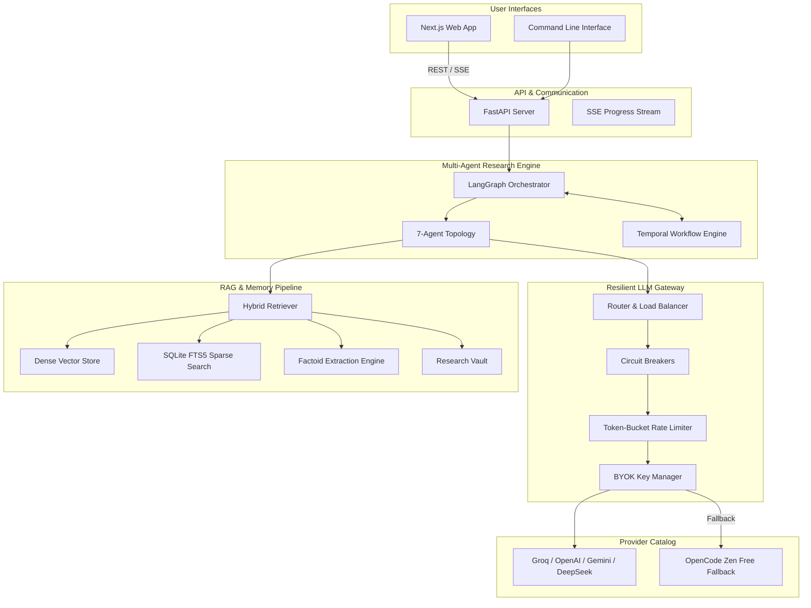
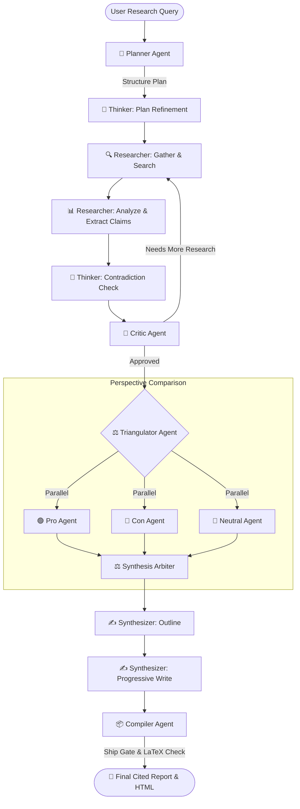

<div align="center">

# Autonomous Research Agent

### *Multi-Agent Deep Research System built with LangGraph, Temporal & Resilient LLM Gateway*

[](https://python.org)
[](https://github.com/langchain-ai/langgraph)
[](https://temporal.io)
[](https://nextjs.org)
[](docs/PROVIDERS.md)

---

**A multi-agent research application that plans, searches, verifies, and synthesizes cited research reports with live progress streaming, LaTeX math rendering, and durable execution support.**

*Runs out-of-the-box using built-in free tier fallback (OpenCode Zen) or with your own provider API keys (Groq, OpenAI, Gemini, DeepSeek).*

---

[Features](#-key-features) •
[Quick Start](#-quick-start) •
[Architecture](#-architecture) •
[Research Modes](#-research-modes) •
[Documentation](#-documentation)

---

</div>

## 🌟 Key Features

| Feature | Technical Implementation | Purpose |
| :--- | :--- | :--- |
| 🤖 **7-Agent LangGraph Topology** | Modular agent graph (**Planner**, **Thinker**, **Researcher**, **Critic**, **Triangulator**, **Synthesizer**, & **Compiler**) with iterative review loops. | Breaks complex research queries into structured subtasks and verifies section coverage before export. |
| ⚖️ **Adversarial Triangulation** | Parallel **Pro**, **Con**, and **Neutral** sub-agent calls arbitrated by a **Synthesis Arbiter**. | Identifies opposing perspectives and potential biases on comparative or subjective research topics. |
| ⚡ **Resilient BYOK Gateway** | In-process REST router with circuit breakers per endpoint, token-bucket rate limiters, retries with jitter, and automatic provider failover. | Gracefully handles rate limits and API outages, falling back to **OpenCode Zen Free** when no paid keys are set. |
| 🧠 **Factoid RAG & Compression** | Hybrid retrieval combining **Dense Vector Search**, **SQLite FTS5 Sparse Search**, and **Factoid Extraction**. | Extracts structured factual claims from web pages to reduce prompt token consumption during report writing. |
| ⏳ **Durable Temporal Workflows** | Event-driven workflow definitions with state checkpointing and activity-based task execution. | Supports long-running research tasks with crash recovery and human-in-the-loop approval readiness. |
| 🧮 **LaTeX & MathJax Rendering** | Automated detection and sanitization of inline and block LaTeX expressions into rendered HTML and Markdown. | Formats mathematical equations, formulas, and scientific notation accurately. |
| 🎨 **Next.js & FastAPI Interface** | Web UI with live Server-Sent Events (SSE) progress tracking, history management, and dark mode. | Provides a clean web app interface alongside CLI and REST API entry points. |

---

## ⚡ Quick Start

### 1. Installation

Requires **Python 3.10+** and [**uv**](https://docs.astral.sh/uv/) package manager.

```bash
# Clone the repository
git clone https://github.com/sarv-projects/Autonomous-Research-Agent.git
cd Autonomous-Research-Agent

# Run automated setup script
bash scripts/install.sh       # Linux / macOS
# or .\scripts\install.ps1     # Windows PowerShell
```

---

### 2. Configuration (Optional)

To enable premium LLM providers or search APIs, create a `.env` file:

```bash
cp .env.example .env
```

Key environment variables:

```ini
# Paid Provider Keys (Optional - falls back to free tier if omitted)
GROQ_API_KEY=gsk_...
OPENAI_API_KEY=sk-...
GEMINI_API_KEY=AIzaSy...
DEEPSEEK_API_KEY=sk-...

# Search Provider (Optional - falls back to built-in scraper & Wikipedia)
TAVILY_API_KEY=tvly-...
```

---

### 3. Usage Options

#### 🖥️ Web Interface

Start the FastAPI backend server:

```bash
uv run python main.py server
# API Docs available at http://localhost:8000/docs
```

In a second terminal, launch the Next.js frontend:

```bash
cd frontend
npm install
npm run dev
# Access the Web UI at http://localhost:3000
```

#### 💻 Command Line Interface (CLI)

```bash
# System Doctor — Verify gateway routes & tool readiness
uv run python main.py doctor

# Interactive Chat with memory
uv run python main.py chat

# Run Autonomous Research
uv run python main.py research "Recent developments in quantum computing" --mode deep

# Execute Evaluation Suite
uv run python main.py eval all

# Inspect Past Research History
uv run python main.py --history
```

---

## 🏗️ Architecture

### System Overview



---

### Multi-Agent Workflow Topology



---

## 🎯 Research Modes & Quality Dials

### Research Modes

| Mode | Target Use Case | Max Iterations | Autonomy Level | Temporal Execution |
| :--- | :--- | :---: | :---: | :---: |
| `chat` | Conversational Q&A with memory context | 1 | L0 | ❌ |
| `quick` | Surface-level fact finding & summary | 1–2 | L1 | ❌ |
| `standard` | Balanced technical & general research *(default)* | 3–4 | L1 | ❌ |
| `deep` | Thorough investigation with multi-wave verification | 5–6 | L2 | ❌ |
| `recency` | Focus on recent developments & news | 3 | L1 | ❌ |
| `academic` | Scholarly citations, methodology, & formal style | 4 | L2 | ❌ |
| `compare` | Multi-option technical or market comparison | 4 | L2 | ❌ |
| `ultra-long` | **Long-running execution** via Temporal.io | 10+ | L3 | ✅ |

### Quality Dials

- ⚡ **ultra-fast**: Fast execution, minimal chunking.
- ⚖️ **balanced**: Standard depth with hybrid retrieval.
- 🎯 **accurate**: Enables Thinker contradiction checks and deeper claim extraction.
- 🔬 **comprehensive**: Enables full Thinker reasoning, perspective triangulation, and factoid compression.

---

## 📂 Project Structure

```
Autonomous-Research-Agent/
├── main.py                 # CLI & Web Server Entry Point
├── config/                 # YAML Configurations
│   ├── providers.yaml     # LLM Provider Catalog
│   └── modes.yaml         # Research Modes & Quality Dials
├── src/
│   ├── graph.py           # LangGraph Orchestration
│   ├── state.py           # Research State Schema
│   ├── llm.py             # Resilient Gateway Interface
│   ├── gateway/           # Resilient BYOK LLM Gateway
│   │   ├── router.py      # Request Routing & Failover Chains
│   │   ├── circuit.py     # Circuit Breakers
│   │   ├── ratelimit.py   # Token-Bucket Rate Limiter
│   │   ├── keys.py        # Key Manager & Accounting
│   │   ├── metrics.py     # Telemetry & Performance Metrics
│   │   └── providers.py   # REST Adapters
│   ├── engine/            # Multi-Agent Architecture
│   │   ├── agents/        # Planner, Thinker, Researcher, Critic, Triangulator, Synthesizer, Compiler
│   │   ├── temporal/      # Temporal Workflows & Activities
│   │   ├── modes.py       # Mode & Budget Resolution
│   │   └── progress.py    # Progress Tracker & Event Streamer
│   ├── rag/               # Retrieval-Augmented Generation
│   │   ├── pipeline.py    # End-to-End Ingestion & Retrieval
│   │   ├── factoid.py     # Factoid Extraction
│   │   ├── guard.py       # Retriever Guard Source Quality Scorer
│   │   ├── hybrid.py      # Dense Vector + Sparse FTS5 Search
│   │   └── vault.py       # Source Cache
│   ├── tools/             # Tool Bus & Registry
│   │   ├── executor.py    # Tool Execution Orchestrator
│   │   └── adapters/      # Built-in Scraper, Wikipedia, Tavily, Firecrawl
│   ├── render/            # LaTeX Math Sanitizer & HTML Renderer
│   ├── eval/              # Evaluation Framework
│   └── web/               # FastAPI REST API Backend
├── frontend/              # Next.js 14 Web Interface
│   ├── app/               # Next.js App Router
│   └── components/        # UI Components
├── docs/                  # System Specifications & Audit Notes
└── reports/               # Output Directory for Generated Reports
```

---

## 🧪 Evaluation System

Run evaluation benchmarks locally using the evaluation framework:

```bash
# Run all component and system evaluations
uv run python main.py eval all

# Evaluate specific suites
uv run python main.py eval component
uv run python main.py eval system
```

---

## 📚 Documentation Index

| Document | Description |
| :--- | :--- |
| 📖 [**SPEC.md**](docs/SPEC.md) | Product requirements and design goals. |
| 🏗️ [**ARCHITECTURE.md**](docs/ARCHITECTURE.md) | Technical architecture and data flows. |
| 🚀 [**INSTALL.md**](docs/INSTALL.md) | Setup and installation instructions. |
| 🔌 [**PROVIDERS.md**](docs/PROVIDERS.md) | Provider catalog setup and API keys. |
| 📊 [**IMPLEMENTATION_STATUS.md**](docs/IMPLEMENTATION_STATUS.md) | Audit notes on implemented features and missing items. |
| 🧪 [**EVALS.md**](docs/EVALS.md) | Evaluation framework methodology and benchmarks. |
| 🛡️ [**GATEWAY.md**](docs/GATEWAY.md) | Architecture specification for the Resilient BYOK Gateway. |
| 🧩 [**FACTOID_PIPELINE.md**](docs/FACTOID_PIPELINE.md) | Details on the factoid extraction pipeline. |
| 🗺️ [**ROADMAP.md**](docs/ROADMAP.md) | Feature roadmap and implementation status. |

---

## 📄 License

This project is licensed under the MIT License - see the LICENSE file for details.
