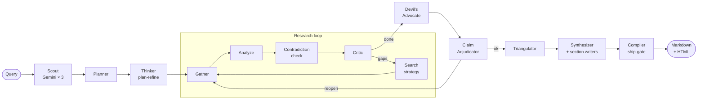

<div align="center">

# Providence

**Autonomous deep-research engine. Every source in the final report was actually fetched.**

[](LICENSE)
[](https://python.org)
[](https://github.com/langchain-ai/langgraph)
[](https://fastapi.tiangolo.com)
[](https://nextjs.org)
[](https://docs.astral.sh/uv/)

</div>

---

LLMs hallucinate citations. Most "deep research" wrappers cite pages they never opened. Providence enforces a hard **compiler ship-gate**: the final Sources list is built exclusively from URLs fetched and parsed during that run. No invented references ship.

Under the hood it runs a multi-agent LangGraph pipeline — Scout → Planner → iterative Research loop with Critic → Devil's Advocate → Claim Adjudicator → parallel Section Writers → Compiler. Reports are written section-by-section from retrieved chunks, not from one fragile megaprompt.

**Works out of the box with zero API keys.** Add Gemini and Exa whenever you want stronger reasoning and neural search.

```bash
git clone https://github.com/sarv-projects/Autonomous-Research-Agent.git
cd Autonomous-Research-Agent
bash scripts/install.sh
uv run python main.py research "How does RAG reduce hallucination in LLMs?" --mode standard
```

---

## What Providence Can Do

### 🔬 Research any topic — thoroughly

Providence is not a single LLM call with a web-search wrapper. It runs a **14-node adversarial pipeline** that scouts, plans, iterates, argues against itself, adjudicates facts, and synthesizes — before the compiler ever writes a single citation:

- **Multi-query iterative retrieval** — the Critic evaluates coverage after each loop and sends the pipeline back out for more targeted searches until the evidence is sufficient or the budget is hit.
- **Adversarial devil's advocate pass** — a dedicated agent is explicitly tasked with finding counter-evidence, minority views, methodological flaws, and edge cases. These surface in the final report's *Evidence Bedrock* and *Research Debt* sections — not silently dropped.
- **Socratic claim adjudication** — contested claims are checked against the actual text of retrieved pages. If a claim cannot be grounded, it's flagged or triggers a one-hop re-gather before the report is written.
- **Cross-source triangulation** — the Triangulator compares findings across independent domains to surface consensus vs. genuine disagreement before synthesis.
- **Parallel section writing from isolated RAG retrieval** — each report section is written by a dedicated writer agent that retrieves its own relevant chunks from the per-run LanceDB+FTS5 index. No section can hallucinate from another section's context.

### 📋 8 Research modes for every use case

| Mode | Best for |
|---|---|
| `quick` | Fast briefs, definitions, quick factual checks (1–3 min) |
| `standard` | Full iterative research on any complex topic (5–10 min) |
| `deep` | Critical intelligence where you need every angle covered (10–20 min) |
| `academic` | Literature reviews, arXiv-first, peer-reviewed citation coverage (8–15 min) |
| `compare` | Structured A vs B matrix — technology evaluations, trade-off analysis |
| `recency` | Breaking news, policy changes, fast-moving markets |
| `ultra-long` | 24-hour durable research surveys via Temporal for the broadest coverage |
| `chat` | Conversational assistant that escalates complex queries to full research |

### 📄 Reports you can actually trust and use

Every generated report contains four structured, non-optional sections:

- **Inference Body** — the main analysis with inline `[n]` citations remapped to verified sources
- **Evidence Bedrock** — direct quotes from fetched pages, classified as *supported*, *contested*, or *synthetic*
- **Research Debt** — explicit log of unanswered sub-questions, coverage gaps, and confidence bounds — Providence tells you what it doesn't know
- **Sources** — a numbered list of canonical URLs that were fetched and parsed during this specific run; inline citation markers are remapped to this list, orphaned numbers dropped, and no URL from outside the run can appear here

Reports export as both **Markdown** and **MathJax-rendered HTML** with full LaTeX support for mathematical notation.

### 🧠 14 specialized agents, not one

| Agent | Role |
|---|---|
| **Scout** | 3 parallel Gemini calls + light web reconnaissance to frame the topic |
| **Planner** | Decomposes the query into subtasks and a structured research plan |
| **Thinker (plan refine)** | Gemini pass to identify blind spots in the plan before gathering begins |
| **Researcher Gather** | Runs the full tool bus — up to 9 retrieval sources per iteration |
| **Researcher Analyze** | Clusters and extracts structured facts from raw fetched text |
| **Thinker (contradiction check)** | Detects factual inconsistencies across gathered sources |
| **Critic** | Evaluates evidence breadth, depth, and topicality; decides whether to loop |
| **Thinker (search strategy)** | Reformulates queries and identifies unexplored source types for the next loop |
| **Devil's Advocate** | Actively searches for counter-evidence, limitations, and minority positions |
| **Claim Adjudicator** | Verifies specific claims against the text of fetched pages (Socratic) |
| **Triangulator** | Aggregates cross-source consensus before synthesis (on `accurate`/`comprehensive` dials) |
| **Synthesizer Outline** | Builds the section decomposition plan from the full evidence corpus |
| **Synthesizer Write** | Parallel section writers — each grounded in its own RAG retrieval |
| **Compiler** | Assembles the final report, enforces the ship-gate, remaps and validates all citations |

### 🔎 9+ retrieval sources, not just one search API

Providence pulls from multiple tools simultaneously and falls back automatically:

| Tool | Triggered when |
|---|---|
| **Exa** neural search | `EXA_API_KEY` set — primary, full page text |
| **Firecrawl** | `FIRECRAWL_API_KEY` or self-hosted on `:3002` |
| **Tavily** | `TAVILY_API_KEY` set |
| **NewsData** | `NEWSDATA_API_KEY` set |
| **GDELT** | Always available (no key) — global event coverage |
| **Wikipedia** | Always available (no key) |
| **DuckDuckGo + Trafilatura** | Built-in scraper — always available (no key) |
| **arXiv** | Automatically prioritized in `academic` and `deep` modes |
| **MinerU / Nougat / LlamaParse** | Optional PDF extraction adapters (PyPDF fallback) |

### ⚡ Resilient multi-provider gateway — no single point of failure

Every LLM call goes through `src/gateway/` (no LiteLLM process, pure stdlib HTTP):

- **Circuit breakers** — CLOSED / OPEN / HALF-OPEN per route; automatic recovery after cooldown
- **Token-bucket rate limiters** — per-provider RPM and TPM caps with real-time accounting
- **Jitter retry with exponential backoff** — retriable errors (429, 5xx, timeout) retry with backoff; non-retriable (401, 404) move immediately to the next route
- **Automatic failover** — `nemotron-3-ultra-free` → `hy3-free` → `nemotron-3.5-lightning-free` → `big-pickle` → (paid, if keys present) — seamless, no user action needed
- **Budget enforcement** — per-run token, cost, time, and tool-call budgets defined per mode in `config/modes.yaml`
- **Prometheus metrics** — all call counts, token usage, cost, and latency at `/metrics`

### 🗄️ Hybrid RAG — better recall than pure vector search

- **Per-run isolation** — each research run gets its own LanceDB collection, keyed by `run_id`; no cross-contamination between runs
- **Dual-path retrieval** — dense vector search (OpenAI embeddings if key present, local bag-of-words otherwise) combined with BM25/FTS5 full-text search, fused with Reciprocal Rank Fusion (RRF)
- **Retriever Guard** — domain scoring, topicality filter, and stop-word gating prevent off-topic chunks from reaching writers
- **Parent-child chunking** — optional `RAG_PARENT_CHILD=1` for improved recall on long documents
- **Vault** — `data/vault.db` re-uses on-topic past sources across sessions for research continuity
- **Factoid extraction** — structured fact atoms extracted from chunks for `ultra-long` / `comprehensive` dial runs

### 🎛️ 3 autonomy levels for every workflow

- **L1 — Fully autonomous** (default): plan to report in one go, no interruptions
- **L2 — Human-in-the-loop**: Providence surfaces clarifying questions, waits for answers, then shows the full research plan for approval before a single fetch begins
- **L3 — Unattended batch**: strict spend caps, automated fallback handling, hard export gates — safe for overnight/scheduled runs

### 📊 Empirically evaluated

- **86% fact-check accuracy** across 15 high-complexity research topics scored against independently verified ground truth
- **0 fabricated source lists** across all 15 runs — the ship-gate works
- **~8.1 min average** per comprehensive research report on Groq + Exa stack
- **~48 000 words** largest single report generated
- **100-task DeepResearch Bench (DRB)** scoring protocol implemented against the same RACE formula used by published leaderboard numbers (Gemini 2.5 Pro ≈ 48.9, OpenAI Deep Research ≈ 47.0)

---

## Table of Contents

- [Why Providence](#why-providence)
- [Architecture](#architecture)
- [Quickstart](#quickstart)
- [Research Modes](#research-modes)
- [Providers & Keys](#providers--keys)
- [CLI Reference](#cli-reference)
- [Web UI & Dashboard](#web-ui--dashboard)
- [Benchmarks](#benchmarks)
- [Project Layout](#project-layout)
- [Testing](#testing)
- [Docs](#docs)
- [License](#license)

---

## Why Providence

| Problem | What Providence does |
|---|---|
| LLMs invent citations | **Compiler ship-gate** — Sources built from this run's fetch log only. Hallucinated URLs and `example.com` placeholders are dropped before export. |
| Confirmation bias | **Adversarial pass** — an explicit Devil's Advocate agent hunts counter-evidence and limitations before synthesis begins. |
| Context-window collapse | **Isolated per-run RAG** — LanceDB + FTS5, dense/keyword RRF. Each run gets its own index; retrieved chunks are the only input to writers. |
| One-shot megaprompt failures | **Parallel section synthesis** — each section is written from its own targeted chunk retrieval. |
| Expensive API lock-in | **Resilient multi-provider gateway** — circuit breakers, token-bucket rate limiters, automatic failover. Free Zen models work with no key at all. |

---

## Architecture

The A4 LangGraph graph (`src/graph.py`):

```
Query
 └─ Scout (Gemini × 3 parallel, web peek)
     └─ Planner (Zen) → Thinker plan-refine (Gemini, if enabled)
         └─ Research loop ───────────────────────────────────────┐
             Gather (tool bus: Exa / wiki / scraper / GDELT …)  │
             → Analyze (cluster + extract)                       │
             → Contradiction check (Gemini, if enabled)         │
             → Critic → Search strategy ──── gaps? ─────────────┘
         └─ Devil's Advocate (counter-evidence)
             └─ Claim Adjudicator (Socratic re-gather, 0–1 hop)
                 └─ Triangulator (cross-source consensus)
                     └─ Synthesizer outline → parallel section write (Zen strong)
                         └─ Compiler ← ship-gate
                             ├─ Inference Body     (cited analysis)
                             ├─ Evidence Bedrock   (supported / contested / synthetic)
                             ├─ Research Debt      (open gaps, confidence bounds)
                             └─ Sources            (this-run URLs only)
```



**Model tiers** (configured in `config/providers.yaml`):

| Tier | Default | Upgrade with a key |
|---|---|---|
| `fast` — planner, critic, extractors | OpenCode Zen free (`nemotron-3-ultra-free`, `hy3-free`, …) | Groq, OpenAI, DeepSeek |
| `strong` — section writers, synthesizer | OpenCode Zen free | Any provider |
| `thinker` — scout, contradiction check, search strategy | **Gemini Flash** (`GEMINI_API_KEY`) | Gemini only by design |

---

## Quickstart

**Requirements:** Python 3.10+, [uv](https://docs.astral.sh/uv/). Node 18+ optional (web UI).

```bash
# 1. Clone and install
git clone https://github.com/sarv-projects/Autonomous-Research-Agent.git
cd Autonomous-Research-Agent
bash scripts/install.sh          # Windows: .\scripts\install.ps1

# 2. Verify the setup
uv run python main.py doctor

# 3. Run (no keys needed)
uv run python main.py research "What are the tradeoffs between SLMs and LLMs?" --mode standard
```

Reports are written to `reports/` as `*.md` and `*.html` (MathJax-rendered).

**Optional keys** — copy `.env.example` and fill in what you have:

```
GEMINI_API_KEY=     # https://aistudio.google.com/apikey  (scout + thinker)
EXA_API_KEY=        # https://exa.ai                      (primary neural search)
FIRECRAWL_API_KEY=  # https://firecrawl.dev               (cloud scraping)
TAVILY_API_KEY=     # https://tavily.com                  (additional search)
```

---

## Research Modes

Pass `--mode <name>`. Default is `standard`.

| Mode | What it does | Typical time |
|---|---|---|
| `quick` | Short brief, minimal iterations | 1–3 min |
| `standard` | Full loop, balanced budget | 5–10 min |
| `deep` | Heavier loop + triangulation, Gemini stays on | 10–20 min |
| `academic` | arXiv-first, deeper citation coverage | 8–15 min |
| `compare` | Structured A vs B comparison matrix | 5–10 min |
| `recency` | Recency-biased search for fast-moving topics | 5–10 min |
| `ultra-long` | 24-hour durable research via Temporal worker | Long / async |
| `chat` | Conversational assistant; auto-escalates to research | Interactive |

**Autonomy levels** (`--autonomy L1|L2|L3`):

| Level | Behaviour |
|---|---|
| `L1` | Fully autonomous end-to-end (default) |
| `L2` | Surfaces clarifying questions, waits for plan approval before gathering |
| `L3` | Unattended batch — strict spend caps and hard export gates |

```bash
uv run python main.py research "Post-quantum cryptography standards survey" \
  --mode academic --autonomy L2
```

---

## Providers & Keys

All LLM calls go through `src/gateway/` — circuit breakers, RPM/TPM token-bucket rate limiters, jitter retry, automatic failover. No LiteLLM process.

**Free path (zero keys):**
- Workhorse: `nemotron-3-ultra-free` → `hy3-free` → `nemotron-3.5-lightning-free` → `big-pickle` (reasoning)
- Search: DuckDuckGo + Trafilatura + Wikipedia + GDELT
- Embeddings: local bag-of-words

**Optional keys (each upgrades one layer independently):**

| Key | What it unlocks |
|---|---|
| `GEMINI_API_KEY` | Thinker tier — scout, contradiction detection, search strategy |
| `EXA_API_KEY` | Neural search with full page text |
| `FIRECRAWL_API_KEY` | Cloud scraping (local scraper is the fallback) |
| `TAVILY_API_KEY` | Additional search/extract endpoint |
| `NEWSDATA_API_KEY` | Newswire access |
| `EMBEDDING_API_KEY` / `USE_CHAT_KEY_FOR_EMBEDDINGS=1` | Dense vector embeddings for better RAG recall |
| `GROQ_API_KEY`, `OPENAI_API_KEY`, `ANTHROPIC_API_KEY`, … | Override Zen free on `fast`/`strong` tiers |

Full catalog: [`config/providers.yaml`](config/providers.yaml) · [`docs/PROVIDERS.md`](docs/PROVIDERS.md)

---

## CLI Reference

```bash
# Research
uv run python main.py research "topic"
uv run python main.py research "Rust vs Go for high-throughput services" --mode compare
uv run python main.py research "Latest solid-state battery developments" --mode recency
uv run python main.py research "Survey of homomorphic encryption" --mode academic --autonomy L2
uv run python main.py research "What is a transformer?" --mode quick

# Interactive chat  (/research <topic> escalates mid-session)
uv run python main.py chat

# System
uv run python main.py doctor       # live provider health + tool readiness
uv run python main.py --history    # past runs and report paths

# Server & worker
uv run python main.py server       # FastAPI on :8001 (docs at /docs)
uv run python main.py worker       # Temporal durable worker (ultra-long mode)

# Evaluation
uv run python main.py eval all
```

---

## Web UI & Dashboard

The frontend is a **Next.js 14** app (`frontend/`) wired to the FastAPI backend via rewrites. All `/api/*` requests are proxied to `localhost:8001` — no CORS config needed.

### Launch the full dev stack

```bash
bash scripts/start-dev.sh
# API → http://localhost:8001   (Swagger at /docs)
# UI  → http://localhost:3000
```

Or separately:

```bash
# Terminal 1 — Python backend
uv run python main.py server

# Terminal 2 — Next.js frontend
cd frontend && npm run dev
```

> **Custom backend port:** set `BACKEND_URL=http://localhost:PORT` before starting Next.js.

### Pages & features

| Route | What it does |
|---|---|
| `/` | Main interface — Chat mode and Research mode in one view |
| `/settings` | Engine & gateway configuration — model picker, mode defaults, budgets |
| `/history` | Past research runs with links to generated reports |
| `/vault` | Research Vault — on-topic past sources reused across sessions |

### Main interface (`/`)

**Chat mode** — streams responses token-by-token via SSE. Automatically escalates long or research-heavy queries to the full research pipeline.

**Research mode** — dispatches a background job to the A4 pipeline and shows a live **ProgressBanner** while it runs:
- Status line: current stage, elapsed seconds, findings count, sources count
- **Next action** — what the agent is about to do
- **Learned** — last 4 facts extracted from retrieved pages
- **Gaps** — open questions the Critic identified for the next loop
- **Thinking stream** — raw agent thought log (kind + text)

**Mode & autonomy selectors** inline in the input bar:
- Dropdown for all 8 modes (`quick` → `ultra-long`)
- Dropdown for autonomy: `L1 auto` / `L2 plan review` / `L3 hard budget`
- `Edit plan first` checkbox — triggers the plan editor at L1 too

**Plan editor (L2 / "Edit plan first")** — when a plan is generated before research begins, an editable panel appears with:
- Clarifying questions from the planner (with text input for answers)
- Outline sections (one per line, editable textarea)
- Search queries (one per line, editable textarea)
- **Approve & research** sends the edited plan and starts the job

**Approval banner** — for L3 workflow gates: polls `/api/approvals` every 10s and surfaces pending gates at the top of the screen with Approve / Reject buttons.

### Settings page (`/settings`)

- **Model picker** — expandable provider groups (OpenCode Zen free first), live probe buttons per provider, status (ok/fail/latency), model selection
- **LLM providers** — registered provider catalog, + Add Provider form (name, endpoint, API key, model list)
- **Research mode defaults** — default mode profile and autonomy level
- **Budget controls** — max cost cap (USD) and max graph iterations
- Save All Settings persists to the backend `/api/settings`

### Tech stack (frontend)

| Package | Role |
|---|---|
| Next.js 14 | Framework, routing, SSR |
| React 18 | UI |
| Tailwind CSS 3 | Styling |
| `react-markdown` + `remark-gfm` | Markdown rendering with GFM tables, code blocks |
| `remark-math` + `rehype-katex` | LaTeX / MathJax rendering in assistant messages |
| `katex` | Math display engine |
| `lucide-react` | Icons |
| `clsx` + `tailwind-merge` | Conditional class utilities |

### Gateway ops dashboard

```bash
uv run python -m src.dashboard --port 8080
# http://localhost:8080
```

| Endpoint | What it shows |
|---|---|
| `/` | Metrics UI — token spend, route health, circuit states |
| `/api/status` | JSON — gateway status + tool-bus `search_cache` |
| `/api/events` | SSE — live gateway events |
| `/metrics` | Prometheus-format metrics |

---

## Benchmarks

**Internal 15-topic suite** — Groq + Exa stack, `standard` mode, scored against independently researched ground truth across geopolitical, scientific, financial, and technology domains:

| Metric | Result |
|---|---|
| Fact-check accuracy | **86%** (76 / 91 verified points) |
| Fabricated source lists | **0 / 15 runs** |
| Average run time | **~8.1 min** |
| Largest report | **~48 000 words** |

> On the free Zen + Gemini scout stack, `standard` typically runs 12–18 min. The averages above used Groq + Exa.

Full per-topic rubrics, fact-check matrices, and three scoring rounds: [`benchmarks/RESEARCH_BENCHMARK.md`](benchmarks/RESEARCH_BENCHMARK.md)

**DeepResearch Bench (100-task DRB)** — self-hosted scoring against the official RACE formula (same protocol as published leaderboard numbers: Gemini 2.5 Pro ≈ 48.9, OpenAI Deep Research ≈ 47.0, Perplexity ≈ 42.3). Full protocol: [`score.md`](score.md)

---

## Project Layout

```
main.py                     CLI entrypoint
config/
  modes.yaml                Budgets, token limits, quality dials per mode
  providers.yaml            Provider catalog, model lists, tier routing
src/
  graph.py                  LangGraph A4 pipeline
  state.py                  Typed ResearchState
  llm.py                    call_llm() → gateway dispatch
  engine/
    agents/                 planner  researcher  thinker  critic
                            adversary  triangulator  synthesizer  compiler
    modes.py                Mode + budget resolution
    temporal/               Optional Temporal worker (ultra-long)
  gateway/                  router  circuit  ratelimit  metrics  keys
  rag/                      LanceDB+FTS5  hybrid-RRF  guard  vault  factoids
  tools/
    adapters/               exa  firecrawl  wikipedia  gdelt
                            tavily  newsdata  builtin-scraper
                            mineru  nougat  llamaparse (PDF)
  render/                   MathJax / LaTeX HTML rendering
  web/                      FastAPI app + SSE streaming
  dashboard/                Gateway ops dashboard
frontend/                   Next.js 14 UI
benchmarks/                 Scoring scripts, ground truth, benchmark reports
docs/                       Architecture, providers, gateway, install
reports/                    Generated *.md + *.html output
```

---

## Testing

```bash
uv run python test_phase_a.py     # provider catalog, gateway Zen-free integration
uv run python test_phase_b.py     # planner, researcher node contracts
uv run python test_phase_c.py     # RAG retrieval, citation integrity
uv run python test_phase_d.py     # critic, adversary outputs
uv run python test_phase_e.py     # claim adjudication, Socratic hop
uv run python test_phase_f.py     # triangulator
uv run python test_phase_g.py     # synthesizer outline + section write
uv run python test_phase_h.py     # compiler ship-gate, citation remapping
uv run python test_phase_i.py     # export: markdown, HTML
uv run python test_phase_l.py     # ultra-long / Temporal path
uv run python test_gateway.py     # gateway routing, circuits, failover

uv run python main.py eval all    # full component + system suite
```

---

## Docs

| Doc | Purpose |
|---|---|
| [INSTALL.md](docs/INSTALL.md) | Environment setup, keys, platform notes, troubleshooting |
| [ARCHITECTURE.md](docs/ARCHITECTURE.md) | Agent contracts, RAG pipeline, compiler ship-gate rules |
| [PROVIDERS.md](docs/PROVIDERS.md) | Zen free model IDs, Gemini setup, optional paid providers |
| [GATEWAY.md](docs/GATEWAY.md) | Circuit-breaker mechanics, rate limiting, ops dashboard |

---

## License

[MIT](LICENSE)
