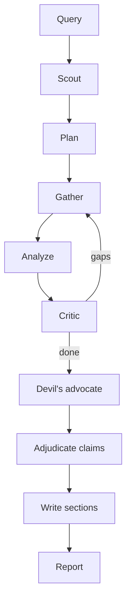

<div align="center">

# Providence

**An open deep-research agent. Reports come with citations, and the Sources list can only contain URLs this run actually fetched.**

[](LICENSE)
[](https://python.org)
[](https://github.com/langchain-ai/langgraph)
[](https://fastapi.tiangolo.com)
[](https://nextjs.org)

</div>

Manual research takes days. Chat models invent sources. Most “deep research” tools still let the writer cite pages they never opened.

Providence runs a planner, a researcher, a critic, a devil’s advocate, and a compiler. The compiler builds **Sources** from this run’s fetch log only. Fake `example.com` links and leftover “References” blocks do not ship.

Works with **no API keys** (OpenCode Zen free). Add Gemini + Exa when you want it stronger.

```bash
uv run python main.py research "How does RAG reduce hallucination in LLMs?" --mode standard
# → reports/*.md + reports/*.html
```

---

## Why this exists

- A literature pass by hand is slow and easy to bias toward what you already believe.
- A single LLM call will happily cite papers it never saw.
- Token limits kill long reports if you dump raw pages into one prompt.
- Search-then-summarize tools skip counter-evidence and never check claims against the corpus.

Providence searches, reads, argues against itself, then writes section-by-section from retrieved chunks — not from one megaprompt.

---

## Architecture

```
Scout (Gemini + web) → Planner → research loop
  gather → analyze → critic → (search again if needed)
→ Devil’s advocate → claim check → (optional triangulation)
→ Parallel section write → Compiler
     Inference body
     Evidence Bedrock   (quotes + supported / contested / synthetic)
     Research Debt      (what is still open)
     Sources            (this-run URLs only)
```



**Models**

| Role | Default | Key |
|------|---------|-----|
| Thinker (scout, refine, contradictions) | Gemini Flash | `GEMINI_API_KEY` |
| Workhorse (plan, extract, write) | OpenCode Zen free — `nemotron-3-ultra-free` first | none |
| Search | Exa, else Wikipedia + built-in scrape | `EXA_API_KEY` recommended |

LangGraph in `src/graph.py`. Gateway handles retries and failover. RAG is LanceDB + FTS5, isolated per `run_id`.

---

## Features

- Multi-agent loop with a critic that can send the run back out to search
- Devil’s advocate pass for limitations and counter-evidence
- Claim adjudication against pages fetched this run
- Parallel section writing (not one giant completion)
- Ship-gate on the Sources list
- Modes: `quick`, `standard`, `deep`, `academic`, `compare`, `recency`, `ultra-long`, `chat`
- CLI and Next.js UI with live progress
- Zero-key path; optional Exa / Gemini / Firecrawl / Tavily

---

## Quick start

Python 3.10+ and [uv](https://docs.astral.sh/uv/).

```bash
git clone https://github.com/sarv-projects/providence.git
cd providence
bash scripts/install.sh          # Windows: .\scripts\install.ps1

uv run python main.py doctor
uv run python main.py research "How do small language models compare to LLMs?" --mode standard
```

UI:

```bash
bash scripts/start-dev.sh        # http://localhost:3000
```

No `.env` required. Optional keys — copy `.env.example`:

```bash
GEMINI_API_KEY=          # https://aistudio.google.com/apikey
EXA_API_KEY=             # https://exa.ai  — primary search
FIRECRAWL_API_KEY=       # optional extract
TAVILY_API_KEY=          # optional search
```

---

## Usage

```bash
uv run python main.py doctor
uv run python main.py research "topic" --mode standard
uv run python main.py research "Rust vs Go" --mode compare
uv run python main.py research "latest 6G papers" --mode recency
uv run python main.py research "survey of homomorphic encryption" --mode academic
uv run python main.py research "what is a transformer" --mode quick
uv run python main.py chat
uv run python main.py server           # :8000
uv run python main.py --history
```

Approve the plan first:

```bash
uv run python main.py research "topic" --mode deep --autonomy L2
```

| Mode | |
|------|--|
| `quick` | Short brief, ~1–3 min |
| `standard` | Default report |
| `deep` | Full loop + triangulation; Gemini stays on after scout |
| `academic` | arXiv-first |
| `compare` | A vs B + matrix |
| `recency` | Recency-biased search |
| `ultra-long` | Large survey (Temporal if configured) |
| `chat` | Multi-turn; can escalate to research |

Autonomy: `L1` run · `L2` approve plan · `L3` unattended + spend cap.

On free Zen models, `standard` is often 4–18 minutes. The published benchmark averages (~8 min) used Groq + Exa.

---

## Evaluation

[15-topic suite](benchmarks/RESEARCH_BENCHMARK.md), scored against independently researched ground truth (Groq + Exa):

| | |
|--|--|
| Fact-check | **86%** (76/91) |
| Fabricated source lists | **0 / 15** |
| Avg runtime | ~8 min |
| Largest report | ~48k words |

Zen free + Gemini scout, `standard`, “SLMs vs LLMs”: ~18 min, 31 this-run sources.

---

## Project structure

```
main.py
config/providers.yaml      # model tiers
config/modes.yaml          # budgets
src/graph.py               # LangGraph
src/engine/agents/         # planner, researcher, thinker, critic, …
src/gateway/               # failover, circuits
src/tools/                 # Exa, wiki, firecrawl, gdelt
src/rag/                   # LanceDB + FTS, vault
src/web/                   # FastAPI
frontend/                  # Next.js
reports/
```

---

## Docs

- [Install](docs/INSTALL.md)
- [Architecture](docs/ARCHITECTURE.md)
- [Providers](docs/PROVIDERS.md)
- [Gateway](docs/GATEWAY.md)

```bash
uv run python test_phase_c.py
uv run python test_gateway.py
uv run python main.py eval all
```

## License

[MIT](LICENSE)
