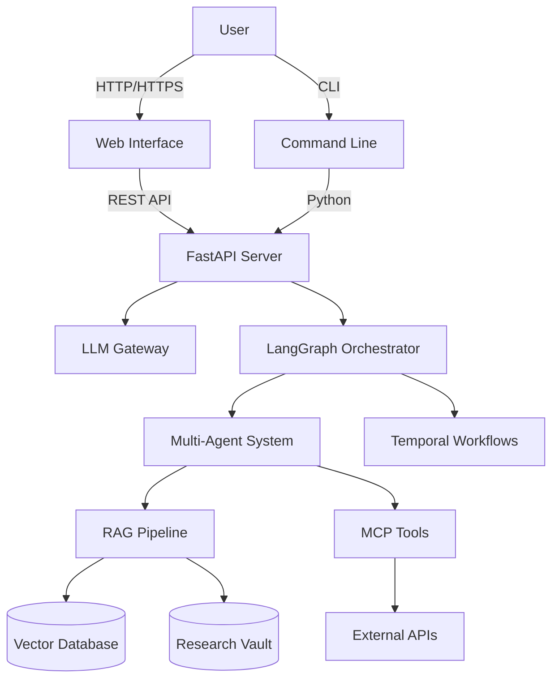
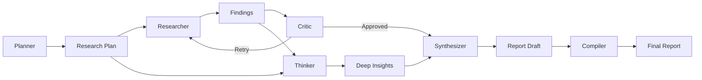
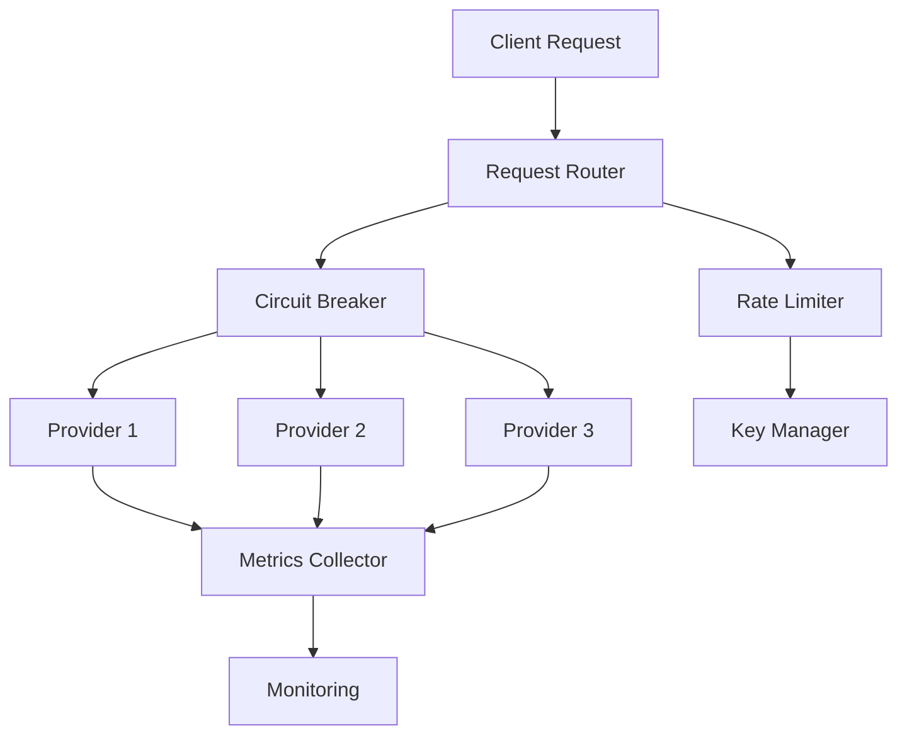
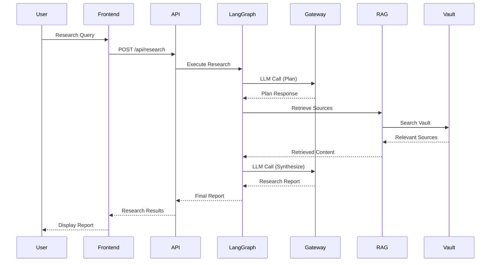

# Autonomous Research Agent

An enterprise-grade autonomous research and chat agent that produces cited, progressive research reports with mathematical rendering, powered by durable execution, bias mitigation, and token optimization.

Built with LangGraph, Temporal.io, adversarial triangulation, factoid extraction, and a production BYOK LLM gateway.

> **Status:** Production-ready with web UI, evaluation system, and Temporal integration. See [IMPLEMENTATION_STATUS.md](docs/IMPLEMENTATION_STATUS.md) for detailed implementation status.

## Documentation

| Document | Purpose |
|----------|---------|
| [SPEC.md](docs/SPEC.md) | Product requirements and target specifications |
| [ARCHITECTURE.md](docs/ARCHITECTURE.md) | System architecture and design decisions |
| [INSTALL.md](docs/INSTALL.md) | Installation and setup instructions |
| [PROVIDERS.md](docs/PROVIDERS.md) | LLM provider configurations and model IDs |
| [ROADMAP.md](docs/ROADMAP.md) | Implementation phases and roadmap |
| [AUDIT.md](docs/AUDIT.md) | Built vs target verification |
| [frontend/README.md](frontend/README.md) | Frontend documentation |

---

## Overview

The Autonomous Research Agent is a multi-agent system designed for deep research and conversational assistance. It combines specialized agents (Planner, Researcher, Critic, Synthesizer, Compiler) with advanced RAG capabilities, durable execution via Temporal.io, and a resilient LLM gateway.

Key differentiators:
- **Cited research reports** with progressive section writing and source verification
- **24-hour durable execution** for long-running research tasks
- **Bias mitigation** through adversarial triangulation (Pro/Con/Neutral agents)
- **Token optimization** via factoid extraction (~90% reduction vs raw content)
- **Mathematical rendering** with LaTeX support for technical content
- **Modern web interface** with ChatGPT-like experience

---

## Capabilities

### Research Capabilities
- **Deep research mode** with multi-agent planning and execution
- **Cited report generation** with progressive section writing
- **Source verification** via Retriever Guard (domain reputation, freshness, quality scoring)
- **Durable execution** for 24-hour research runs with crash recovery
- **Bias mitigation** through adversarial triangulation for subjective queries
- **Token optimization** via factoid extraction pipeline (90% reduction)

### LLM Gateway
- **Multi-provider support** (OpenAI, Anthropic, Google, Groq, DeepSeek, etc.)
- **Resilient routing** with failover chains and circuit breakers
- **Rate limiting** and cost accounting per tenant and model
- **Free tier support** via OpenCode Zen (no API key required)
- **Dynamic provider registration** through configuration files

### RAG & Memory
- **Hybrid retrieval** combining dense vector search and keyword matching
- **Multiple vector backends** (LanceDB, Qdrant, SQLite FTS5)
- **Research vault** for persistent source storage and retrieval
- **Chat memory** for multi-turn conversation context
- **Factoid extraction** for compressed, structured knowledge storage

### Web Interface
- **ChatGPT-like interface** with real-time streaming responses
- **Research mode** with progress tracking and result visualization
- **History management** for past research and conversations
- **Settings configuration** for modes, autonomy levels, and providers
- **Dark mode** with automatic theme switching
- **Responsive design** for desktop and mobile devices

### Evaluation System
- **Component-level evaluations** (tool selection, plan coherence, memory recall)
- **System-level evaluations** (task completion, trajectory, efficiency)
- **Operational metrics** (latency, cost, error rates)
- **CI integration** for automated testing

---

## Architecture

### System Overview



### Multi-Agent System



### LLM Gateway Architecture



### Data Flow



### Project Structure

```
Autonomous-Research-Agent/
├── main.py                 # CLI entry point
├── src/
│   ├── graph.py           # LangGraph orchestration
│   ├── state.py           # Research state management
│   ├── llm.py             # LLM wrapper and gateway integration
│   ├── gateway/           # Resilient LLM gateway
│   │   ├── router.py      # Request routing and failover
│   │   ├── circuit.py     # Circuit breaker implementation
│   │   ├── ratelimit.py   # Rate limiting
│   │   ├── metrics.py     # Metrics collection
│   │   └── providers.py   # Provider adapters
│   ├── providers/         # Provider catalog
│   │   └── catalog.py     # Provider configuration
│   ├── engine/            # Multi-agent system
│   │   ├── agents/        # Agent implementations
│   │   │   ├── planner.py
│   │   │   ├── researcher.py
│   │   │   ├── critic.py
│   │   │   ├── synthesizer.py
│   │   │   ├── compiler.py
│   │   │   ├── thinker.py
│   │   │   └── triangulator.py
│   │   ├── modes.py       # Research modes
│   │   ├── temporal/      # Temporal workflows
│   │   └── progress.py    # Progress tracking
│   ├── rag/               # RAG pipeline
│   │   ├── factoid.py     # Factoid extraction
│   │   ├── guard.py       # Source verification
│   │   ├── pipeline.py    # RAG orchestration
│   │   ├── vault.py       # Research vault
│   │   └── backends/      # Vector database backends
│   ├── render/            # Output rendering
│   │   └── math.py        # LaTeX rendering
│   ├── tools/             # MCP tools
│   │   └── adapters/      # Tool adapters
│   ├── eval/              # Evaluation system
│   └── web/               # FastAPI server
├── frontend/              # Next.js web interface
│   ├── app/               # Next.js app directory
│   └── components/        # React components
├── config/                # Configuration files
│   ├── providers.yaml     # Provider configuration
│   └── modes.yaml         # Research modes
├── docs/                  # Documentation
└── scripts/               # Installation scripts
```

---

## Quick Start

### Prerequisites

- Python 3.14 or higher
- [uv](https://docs.astral.sh/uv/) package manager
- Optional: API keys for paid providers (Groq, OpenAI, OpenRouter, etc.)
- Optional: Temporal Server for durable execution

### Installation

#### Linux/macOS

```bash
git clone https://github.com/sarv-projects/Autonomous-Research-Agent.git
cd Autonomous-Research-Agent
bash scripts/install.sh
```

#### Windows (PowerShell)

```powershell
git clone https://github.com/sarv-projects/Autonomous-Research-Agent.git
cd Autonomous-Research-Agent
.\scripts\install.ps1
```

### Configuration

Copy the example environment file and add your API keys:

```bash
cp .env.example .env
# Edit .env with your API keys (optional - uses free tier without keys)
```

### Running the Application

#### Web Interface (Recommended)

Start the backend API server:

```bash
uv run python main.py server
```

In a new terminal, start the frontend:

```bash
cd frontend
npm install
npm run dev
```

Access the web interface at http://localhost:3000

#### Command Line Interface

```bash
# Interactive chat
uv run python main.py chat

# Deep research
uv run python main.py research "latest developments in quantum computing"

# System health check
uv run python main.py doctor

# Run evaluations
uv run python main.py eval component
uv run python main.py eval system
uv run python main.py eval all

# View research history
uv run python main.py --history
```

---

## Usage

### Research Modes

The agent supports multiple research modes optimized for different use cases:

| Mode | Description | Use Case |
|------|-------------|----------|
| `chat` | Quick conversational responses | General questions, explanations |
| `quick` | Fast surface-level research | Quick fact-finding |
| `standard` | Balanced depth research | General research tasks |
| `deep` | Comprehensive research | Thorough investigation |
| `recency` | Focus on recent developments | Current events, trends |
| `academic` | Academic-style research | Scholarly content, citations |
| `compare` | Comparative analysis | Comparing options/technologies |
| `ultra-long` | 24-hour durable execution | Large-scale research projects |

### Quality Settings

Quality dials can be overlaid on any mode:

- **ultra-fast**: Maximum speed, minimal depth
- **balanced**: Speed and depth balanced
- **accurate**: Higher accuracy, slower execution
- **comprehensive**: Maximum depth and accuracy

### Example Research Session

```bash
# Start a deep research session
uv run python main.py research "impact of artificial intelligence on healthcare" --mode deep --quality comprehensive

# The agent will:
# 1. Plan the research approach
# 2. Gather sources from multiple providers
# 3. Extract and verify information
# 4. Synthesize findings into a structured report
# 5. Compile and export the final report
```

---

## Configuration

### Provider Configuration

Configure LLM providers in `config/providers.yaml`:

```yaml
providers:
  opencode_free:
    name: "OpenCode Zen (Free)"
    base_url: ""  # Empty uses OpenCode Zen free tier
    api_key_env: ""
    models:
      - mimo-v2.5-free
      - deepseek-v4-flash-free

  groq:
    name: "Groq"
    base_url: "https://api.groq.com/openai"
    api_key_env: "GROQ_API_KEY"
    models:
      - llama-3.3-70b-versatile
      - mixtral-8x7b-32768
```

### Research Modes

Configure research modes in `config/modes.yaml`:

```yaml
modes:
  standard:
    max_iterations: 3
    max_cost_usd: 1.0
    autonomy: "L1"
    quality_dial: "balanced"
```

### Environment Variables

Key environment variables:

- `GROQ_API_KEY`: Groq API key
- `OPENAI_API_KEY`: OpenAI API key
- `ANTHROPIC_API_KEY`: Anthropic API key
- `GEMINI_API_KEY`: Google Gemini API key
- `TAVILY_API_KEY`: Tavily search API key
- `GATEWAY_MAX_ATTEMPTS`: Maximum retry attempts
- `GATEWAY_DEFAULT_RPM`: Default requests per minute

---

## Development

### Running Tests

```bash
# Run gateway tests
uv run python test_gateway.py

# Run evaluation suites
uv run python main.py eval component
uv run python main.py eval system
```

### Development Server

```bash
# Backend API
uv run python main.py server

# Frontend (in separate terminal)
cd frontend
npm run dev
```

### Code Structure

The codebase follows a modular architecture:

- **src/gateway/**: LLM gateway with resilient routing
- **src/engine/**: Multi-agent orchestration and modes
- **src/rag/**: Retrieval-augmented generation pipeline
- **src/web/**: FastAPI REST API server
- **frontend/**: Next.js web interface

---

## Contributing

Contributions are welcome. Please see [docs/ROADMAP.md](docs/ROADMAP.md) for the implementation roadmap and planned features.

Before contributing:

1. Check existing issues and pull requests
2. Review the architecture documentation
3. Follow the existing code style and patterns
4. Add tests for new features
5. Update documentation as needed

---

## License

[Specify your license here]

---

## Support

For issues, questions, or contributions:
- GitHub Issues: [Create an issue](https://github.com/sarv-projects/Autonomous-Research-Agent/issues)
- Documentation: [docs/](docs/)
- Implementation Status: [IMPLEMENTATION_STATUS.md](docs/IMPLEMENTATION_STATUS.md)
