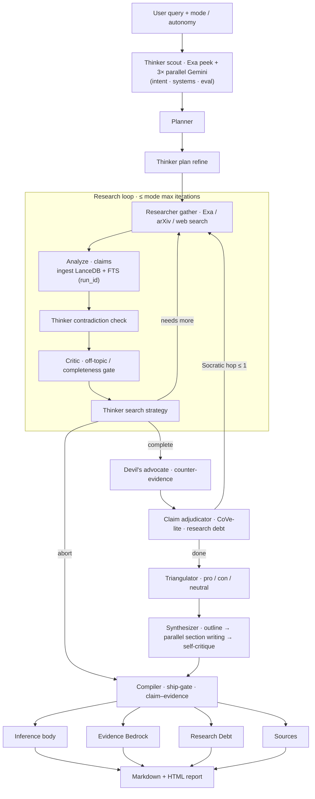
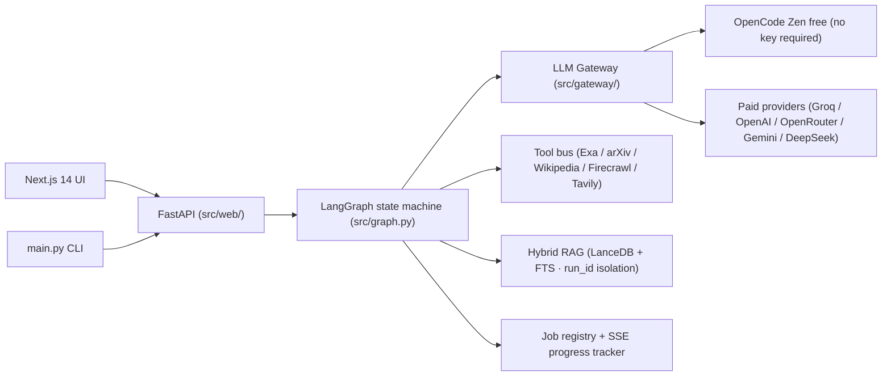

<div align="center">

# Providence

**Deep research engine with verified evidence.**

Give it a hard question. Providence plans the investigation, searches and reads the literature, challenges its own conclusions with adversarial search, verifies every claim against the sources it actually fetched — and compiles a structured, cited report that separates **what is proven** from **what remains open**, with a machine-checked ship-gate that blocks fabricated sources.

[](LICENSE)
[](https://python.org)
[](https://github.com/langchain-ai/langgraph)
[](https://nextjs.org)
[](https://fastapi.tiangolo.com)

*Why “Providence”? Foresight (pro-vidence) + provable evidence. The engine looks ahead through planning and adversarial search, then proves what it claims against the evidence it gathered.*

</div>

---

## Table of Contents

- [What this is](#what-this-is)
- [How it works](#how-it-works)
- [Agent roster](#agent-roster)
- [Architecture](#architecture)
- [Quick Start](#quick-start)
- [Usage](#usage)
  - [Command line](#command-line)
  - [Web UI](#web-ui)
  - [HTTP API](#http-api)
- [Research Modes & Autonomy](#research-modes--autonomy)
- [Configuration](#configuration)
- [Project Structure](#project-structure)
- [Testing & Evaluation](#testing--evaluation)
- [Benchmarks](#benchmarks)
- [Limitations](#limitations)
- [Contributing](#contributing)
- [Documentation](#documentation)
- [License](#license)

---

## What this is

This is a **deep-research engine**, not a chat wrapper. Research is treated as a production pipeline: an investigation is planned before it is executed, sources are gathered and verified against one another, weaknesses are actively hunted by an adversarial agent, and the final report documents its own evidentiary limits in a layered structure:

| Layer | What it contains |
|---|---|
| **Inference body** | The synthesis, with inline citation markers `[N]` |
| **Evidence Bedrock** | Verbatim quotes from this run's sources that anchor the report's claims, each labeled `supported` / `contested` / `synthetic` |
| **Research Debt** | Claims that could not be fully verified, and questions the run could not close |
| **Sources** | URLs actually retrieved during this run — nothing recycled, nothing fabricated |

Every URL in Sources is one that was retrieved and read in that specific run (`run_id`-namespaced). This is enforced mechanically by the compiler, not just by prompting.

---

## How it works

Research is orchestrated as a **LangGraph state machine** (`src/graph.py`) in which ten agent roles — each implemented as a graph node — own one stage, with conditional routers that decide between iteration, Socratic re-gather, escalation, or abort after every key stage:

```
thinker_query_scout → planner → thinker_plan_refine
  → [researcher_gather → researcher_analyze → thinker_contradiction_check
     → critic → thinker_search_strategy] × N
  → devil_advocate_gather → claim_adjudicator
  →(Socratic hop ≤1)→ researcher_gather
  → triangulator → synthesizer_outline → synthesizer_write → compiler
```

An `abort_passthrough` node ensures that a run that cannot recover from off-topic contamination or budget exhaustion still reaches the compiler and emits an honest status report rather than nothing.

---

## Agent roster

### Thinker — `thinker_query_scout`, `thinker_plan_refine`, `thinker_contradiction_check`, `thinker_search_strategy`

The reasoning layer, invoked at four points:

1. **Scout** — opens a run with a light Exa web probe plus three parallel model analyses (intent, systems/papers to cover, evaluation axes/failure modes) so the planner starts from an informed position.
2. **Plan refine** — refines the planner's output before gathering begins.
3. **Contradiction check** — flags contradictions across accumulated claims after each analysis pass.
4. **Search strategy** — crafts the next wave of high-precision queries (targeting named systems, benchmarks, open gaps, optimized for Exa and arXiv).

Runs on the `thinker` model tier. The scout uses three parallel Gemini calls and falls back to the thinker tier when no Gemini key is set. All thinker calls return structured JSON rather than mutating external state directly.

### Planner — `planner`

Decomposes the query into a structured plan: topic, subtopics, report outline (section titles with per-section search queries), recommended source types, and the first wave of queries. Mode-aware: `compare` mode forces a criteria / option-A / option-B / comparison-matrix structure; deep modes require an Evaluation Matrix and a Failure-Mode Taxonomy. If a human has approved or edited a plan (autonomy L2), it adopts that plan verbatim.

### Researcher — `researcher_gather`, `researcher_analyze`

Executes actual gathering:

- **Gather** — runs queries through the tool bus (Exa primary, arXiv, Wikipedia, Firecrawl, Tavily, built-in scraper), merges in on-topic vault hits, passes everything through the retrieval guard (domain blocklists, quality scoring), prefers Exa full text to avoid re-extraction round-trips, and ingests pages into the run's retrieval store (LanceDB + FTS5, namespaced by `run_id`).
- **Analyze** — retrieves the most relevant chunks (dense + sparse + factoid fusion, always filtered to the current `run_id`) and extracts findings, claims with `evidence_ids`, and gaps. Budget-checked every iteration (time, cost, tokens, tool calls).

### Critic — `critic`

The quality gate between research iterations. Checks budgets, scores whether gathered findings and sources are on-topic (heuristic keyword overlap + LLM judgment), and decides: more research (with new gap queries), proceed to adversarial stage, or abort. Hard off-topic contamination drops the offending findings, forces re-search with corrected queries, and — if the run cannot recover within its iteration budget — aborts synthesis with an explicit error.

### Devil's Advocate — `devil_advocate_gather`

A single adversarial search pass that deliberately hunts limitations, failures, retractions, and critiques, targeting both the core topic and the run's top claims. New counter-evidence pages are ingested into the same run's store and surfaced as findings and gaps, so the report's own sources include the case against the mainline view.

### Claim Adjudicator — `claim_adjudicator`

The CoVe-lite verification step. Every extracted claim is scored against the run's corpus — checking phrase/word overlap plus per-URL topicality — and labeled:

- `supported` — claim text appears in retrieved corpus and cited URL's own text backs it
- `contested` — weak or real-but-irrelevant URL evidence
- `synthetic` — no solid corpus anchor found

Contested and synthetic claims become research debt. If a meaningful share fails support, the run may take **one Socratic re-gather hop** (re-searching specifically on contested claims) before synthesis. A final LLM pass distills debt into actionable "what is still unknown" bullets.

### Triangulator — `triangulator`

Bias mitigation for subjective or controversial queries (detected heuristically: `vs` / `compare` / `best` / pros-cons language, or a large diverse claim set). Runs three sub-agents **in parallel** — pro advocate, con critic, neutral analyst — and a synthesis arbiter that scores bias, finds common ground, and writes a balanced synthesis. Outputs are folded back into findings.

### Synthesizer — `synthesizer_outline`, `synthesizer_write`

Writes the report:

- **Outline** — turns findings and the plan into a final section list (mode-aware, ensuring executive summary, evaluation matrix, and failure taxonomy for deep modes).
- **Write** — drafts every body section **in parallel** (up to six threads), each with its own retrieval pass against the run's store and its own token budget, auto-generates the Sources section without an LLM call, then runs an audit & verification pass (citation-coverage checks) and a self-critique pass over the assembled draft.

### Compiler — `compiler`

The ship-gate. It:

- Filters fake/placeholder URLs (banned patterns: `about:blank`, `example.com`, `factoid://`, hallucinated monographs with spaces or brackets)
- Renumbers inline `[N]` citations across parallel-written sections against the final Sources list
- Strips duplicate title headings and trailing References blocks from parallel-writer artifacts
- Verifies claim–evidence coverage using adjudicator labels (or phrase/word fallback)
- Assembles the "confidence volcano": Inference body → **Evidence Bedrock** → **Research Debt** → **Sources**
- Detects and renders LaTeX math via MathJax/KaTeX
- Exports Markdown and HTML to `reports/`
- Under autonomy L3, blocks emission if the ship-gate fails

---

## Architecture

### Research pipeline



### Supporting stack



### Subsystems

| Subsystem | What it does |
|---|---|
| **LLM Gateway** (`src/gateway/`) | Three tiers (`fast` / `strong` / `thinker`), failover chains, per-route circuit breakers (CLOSED/OPEN/HALF-OPEN), token-bucket RPM/TPM rate limiting, retry+jitter, BYOK virtual-key management (SHA-256 hashed), optional AES-GCM provider-key encryption at rest, cost accounting, Prometheus metrics |
| **Tool bus** (`src/tools/`) | Pluggable search adapters auto-registered from `src/tools/adapters/`: Exa (primary, full-text), arXiv, Wikipedia, Firecrawl, Tavily, MinerU (PDF), Nougat (OCR), built-in scraper (trafilatura), **GDELT** (zero-key real-time global newswire) + NewsData.io (keyed supplement) |
| **Hybrid RAG** (`src/rag/`) | Dense vector search (LanceDB) + sparse keyword search (SQLite FTS5), per-run `run_id` isolation, on-topic vault for deliberate cross-run reuse, factoid extraction pipeline, retrieval guard (domain blocklists + quality scoring), chat memory, hybrid score fusion |
| **Providers catalog** (`src/providers/`) | `config/providers.yaml`-driven catalog with model probes and live availability checks |
| **Mode system** (`src/engine/modes.py`) | `config/modes.yaml`-loaded modes with per-mode `ModeBudgets` (max_tokens, max_cost_usd, max_time_s, max_tool_calls, max_iterations) and `QualityDial` overlays |
| **Progress & jobs** (`src/engine/progress.py`, `jobs.py`) | Thread-safe in-process job registry + progress tracker recording `learned / gaps / next_action` for the thinking panel and SSE streaming |
| **Plan store** (`src/engine/plan_store.py`) | Editable research plan state for autonomy L2 human-in-the-loop plan approval gate |
| **Clarify** (`src/engine/clarify.py`) | Ambiguity detection + ChatGPT-style clarifying questions prelude for vague queries |
| **Budget enforcement** (`src/engine/budget.py`) | Runtime checks on time, cost, token, and tool-call limits; syncs live gateway metrics into state |
| **Durable execution** (`src/engine/temporal/`) | Optional Temporal.io workflows (`ResearchWorkflow`, `HumanInLoopWorkflow`) for ultra-long runs that must survive restarts; automatic in-process fallback |
| **Rendering** (`src/render/`) | LaTeX detection, sanitization, MathJax CDN wrapping, Markdown→HTML conversion |
| **Gateway dashboard** (`src/dashboard/`) | Zero-dependency stdlib-only dashboard (ThreadingHTTPServer + SSE) with live metrics, circuit breaker states, research progress stream, and Prometheus `/metrics` endpoint |
| **Eval framework** (`src/eval/`) | Component evaluators (tool selection, plan coherence, memory recall, RAG IR, citation grounding) + system evaluators (task completion, trajectory, efficiency, research quality) |

### Integrity, mechanically

The property this system cares most about: **the report says what the evidence says**.

- **Per-run retrieval isolation** — every run indexes into its own `run_id` namespace; topic A can never cite sources ingested for topic B
- **Off-topic detection** — if a run drifts outside the plan, it re-searches or aborts instead of hallucinating forward
- **Claim–evidence verification** — claims are scored against corpus and labeled before compilation
- **Evidence-URL traceability** — only URLs actually fetched this run appear in Sources; LLM-fabricated IDs are filtered at the compiler
- **Ship-gate** — a report that fails evidence checks is blocked from emission under autonomy L3

---

## Quick Start

**Prerequisites:** Python 3.10+ and [uv](https://docs.astral.sh/uv/).

```bash
# 1. Clone
git clone https://github.com/sarv-projects/providence.git
cd providence

# 2. Install (creates venv, syncs dependencies, runs offline gateway tests)
bash scripts/install.sh          # or .\scripts\install.ps1 on Windows

# 3. Configure (optional — works without any keys via OpenCode Zen free)
cp .env.example .env             # add API keys as needed
```

The engine ships with **OpenCode Zen free** as the default provider chain (no API key required). Retrieval breadth and synthesis quality scale with the keys you provide:

```ini
# Primary workhorse (pick one or more)
GROQ_API_KEY=gsk_...          # fast + strong tiers
GEMINI_API_KEY=...            # thinker tier; parallel scout calls
OPENAI_API_KEY=sk-...         # optional fallback

# Search (highly recommended)
EXA_API_KEY=...               # primary neural search (full-text retrieval)
TAVILY_API_KEY=...            # comprehensive web search fallback
FIRECRAWL_API_KEY=...         # deep page extraction
```

---

## Usage

### Command line

```bash
# System health check — gateway routes, tools, provider status, Zen free probe
uv run python main.py doctor

# Run research
uv run python main.py research "How does RAG reduce hallucination in LLMs?" --mode deep
uv run python main.py research "Rust vs Go for backend services" --mode compare
uv run python main.py research "Latest developments in diffusion models" --mode recency
uv run python main.py research "Impact of quantum computing on cryptography" --mode academic
uv run python main.py research "Quick facts on transformers" --mode quick

# Autonomy L2 — pause at plan approval gate before research
uv run python main.py research "AI safety approaches" --mode deep --autonomy L2

# Interactive chat (conversation memory + auto-escalation to research)
uv run python main.py chat

# Evaluation suites (offline)
uv run python main.py eval all
uv run python main.py eval component
uv run python main.py eval system

# Start API server (default port 8000; override with PORT env var)
uv run python main.py server

# Start Temporal durable worker (optional, for ultra-long runs)
uv run python main.py worker

# View past research history
uv run python main.py --history
```

### Web UI

```bash
bash scripts/start-dev.sh
# Next.js UI:      http://localhost:3000
# API docs:        http://localhost:8000/docs
# GW dashboard:    http://localhost:8080  (python -m src.dashboard)
```

The UI provides:
- **Chat** — multi-turn chat with session memory, streaming responses, auto-escalation to deep research
- **Research launcher** — mode and autonomy controls, background job tracking with progress
- **Plan editor** — editable research plan for autonomy L2 (outline, queries, section titles)
- **Thinking panel** — live `learned / gaps / next_action` stream via SSE
- **Model picker** — browse provider catalog, live model probes with latency display
- **History** — past research runs with report links
- **Vault** — search persistent cross-run knowledge store
- **Settings** — workspace research settings, provider configuration

### HTTP API

The FastAPI backend (`uv run python main.py server`, default port 8000):

| Endpoint | Method | Purpose |
|----------|--------|---------|
| `/api/status` | `GET` | System health, gateway routes, live metrics |
| `/api/research` | `POST` | Start research (sync or background job) |
| `/api/research/plans` | `POST` | Generate an editable research plan |
| `/api/research/plans/{id}` | `GET` | Get plan details |
| `/api/research/plans/{id}` | `PUT` | Edit plan (outline, queries, clarifications) |
| `/api/research/plans/{id}/run` | `POST` | Approve and run an edited plan |
| `/api/research/progress` | `GET` | Poll current run progress snapshot |
| `/api/research/stream` | `GET` | SSE stream of live research progress |
| `/api/research/clarify` | `POST` | Generate clarifying questions for a query |
| `/api/chat` | `POST` | Multi-turn chat (streaming via SSE) |
| `/api/jobs/{id}` | `GET` | Async job status and result |
| `/api/modes` | `GET` | List research modes and quality dials |
| `/api/providers` | `GET` / `POST` | Provider catalog; dynamically register providers |
| `/api/models` | `GET` | Model catalog with capabilities |
| `/api/models/probe` | `POST` | Live probe a specific model |
| `/api/settings` | `GET` / `POST` | Workspace research settings |
| `/api/reports` | `GET` | List generated reports on disk |
| `/api/vault/search` | `GET` | Query persistent research vault |
| `/api/history` | `GET` | Past search and research history |
| `/api/approvals` | `GET` | List pending human approval requests (L2) |
| `/api/approvals/{id}/respond` | `POST` | Respond to a pending plan approval |

---

## Research Modes & Autonomy

### Modes

Modes are defined in `config/modes.yaml` with per-mode budgets and quality dials:

| Mode | Use case | Typical depth | Key flags |
|------|----------|---------------|-----------|
| `chat` | Conversational assistant | Single LLM call | No research loop |
| `quick` | Fast facts / briefs | 1–2 iterations | Minimal tools |
| `standard` | Balanced default | 3–4 iterations | arXiv bias, vault RAG |
| `deep` | Full integrity pipeline | ~4 iterations + Socratic hop | Adversary + adjudicator + debt |
| `academic` | Papers-first | Deep-like | arXiv bias, academic sources |
| `compare` | A vs B structured matrix | Structured outline | Forces comparison-matrix section |
| `recency` | Time-biased (latest news/papers) | Standard-like | Recency bias in queries |
| `ultra-long` | Extended / durable runs | Extended horizon | Optional Temporal.io |

### Autonomy levels

| Level | Behavior |
|-------|----------|
| `L1` | Fully autonomous; report generated end-to-end without human gates |
| `L2` | Plan review gate — human approves/edits the plan before gather begins |
| `L3` | Unattended within hard cost/token/tool budgets; strict ship-gate blocks on failure |

---

## Configuration

All configuration is file- or env-driven. See `.env.example` and `config/` for full details.

### LLM Providers & Gateway

Provider tiers and failover chains are configured in `config/providers.yaml`. The gateway supports:

| Provider | Env var | Notes |
|----------|---------|-------|
| **OpenCode Zen free** | *(no key)* | Always available; default fast/strong/thinker fallback |
| **Groq** | `GROQ_API_KEY[,_2..N]` | Pool of keys; rotation/load-balancing |
| **OpenAI** | `OPENAI_API_KEY[,_2..N]` | Standard OpenAI-compatible |
| **OpenRouter** | `OPENROUTER_API_KEY` | Access 300+ models |
| **Google Gemini** | `GEMINI_API_KEY` | Thinker tier + parallel scout |
| **Anthropic** | `ANTHROPIC_API_KEY` | `anthropic_messages` protocol |
| **DeepSeek** | `DEEPSEEK_API_KEY` | |
| **NVIDIA NIM** | `NVIDIA_API_KEY` | |
| **Cohere** | `CO_API_KEY` | `cohere_v2_chat` protocol |

Gateway tuning:

```ini
GATEWAY_MASTER_KEY=...          # AES-GCM encryption of provider secrets at rest
GATEWAY_MAX_ATTEMPTS=3          # retries per route
GATEWAY_RETRY_BASE_S=0.5        # backoff base (seconds)
GATEWAY_RETRY_CAP_S=8           # backoff cap (seconds)
GATEWAY_DEFAULT_RPM=60          # per (tenant, model) requests/min
GATEWAY_DEFAULT_TPM=120000      # per (tenant, model) tokens/min
GATEWAY_MAX_PARALLEL=20         # max concurrent in-flight requests
GATEWAY_CIRCUIT_THRESHOLD=5     # failures before circuit opens
GATEWAY_CIRCUIT_COOLDOWN_S=30   # circuit open duration (seconds)
GATEWAY_CIRCUIT_HALF_OPEN=2     # max probes in HALF-OPEN state
```

### Search & Extraction Tools

| Tool | Env var | Capability |
|------|---------|-----------|
| **Exa** | `EXA_API_KEY` | Primary neural search; full-text retrieval |
| **Tavily** | `TAVILY_API_KEY` | Comprehensive web search |
| **Firecrawl** | `FIRECRAWL_API_KEY` | Deep page extraction / crawling |
| **Wikipedia** | *(none)* | Free; always available |
| **arXiv** | *(none)* | Free; always available |
| **GDELT** | *(none)* | Zero-key real-time global newswire (Reuters/Bloomberg/FT syndicated wire, 100+ langs); throttled under concurrency, auto-retries |
| **NewsData.io** | `NEWSDATA_API_KEY` | Keyed newswire supplement — free tier is commercial-OK (~200 credits/day) |
| **MinerU** | `MINERU_API_KEY` | PDF/paper extraction |
| **Nougat** | local | OCR for scientific papers |
| **Built-in scraper** | *(none)* | trafilatura-based; free fallback |

### Vector Backend

```ini
VECTOR_BACKEND=lancedb        # lancedb (default) | fts (SQLite FTS5 only) | qdrant
QDRANT_URL=http://localhost:6333
EMBEDDING_API_KEY=...         # dedicated embeddings key
OPENAI_EMBEDDING_KEY=...
USE_CHAT_KEY_FOR_EMBEDDINGS=0 # set 1 to reuse OPENAI_API_KEY for embeddings
EMBEDDING_LOCAL=bow           # bow | dummy — local fallback without any API
```

### Durable Execution (Temporal)

```ini
TEMPORAL_SERVER_ADDRESS=localhost:7233
TEMPORAL_TASK_QUEUE=research-agent
```

Without a Temporal cluster, `ultra-long` mode falls back to in-process execution automatically.

### Other settings

```ini
PORT=8000                     # API server port (default 8000)
DATA_DIR=./data               # data directory
REPORTS_DIR=./reports         # report output directory
FACTOID_MODEL=llama3:8b       # local Ollama model for factoid extraction
OLLAMA_BASE_URL=http://localhost:11434
```

---

## Project Structure

```
providence/
├── main.py                     # CLI entry point + uvicorn server launcher
├── pyproject.toml              # Python project (name: providence, v0.3.0)
├── config/
│   ├── providers.yaml          # LLM provider catalog, model IDs, tier chains
│   ├── providers.example.yaml  # annotated template
│   └── modes.yaml              # research modes, budgets, quality dials
├── src/
│   ├── graph.py                # LangGraph state machine — build_graph(), run_research()
│   ├── state.py                # ResearchState TypedDict + initial_state()
│   ├── nodes.py                # Legacy/compat node wrappers
│   ├── llm.py                  # call_llm(), call_llm_stream(), gateway_info()
│   ├── memory.py               # Search history persistence
│   ├── search.py               # High-level search orchestration
│   ├── export.py               # save_markdown(), save_html()
│   ├── urlutil.py              # canonical_url() for deduplication
│   ├── gateway/
│   │   ├── __init__.py         # build_gateway_from_env() — wires all layers
│   │   ├── router.py           # Gateway orchestrator: failover, retry+jitter, cost
│   │   ├── providers.py        # OpenAICompatibleProvider (OpenAI / Anthropic / Cohere)
│   │   ├── circuit.py          # CircuitBreaker + CircuitRegistry (CLOSED/OPEN/HALF-OPEN)
│   │   ├── ratelimit.py        # TokenBucket RPM/TPM + concurrency cap
│   │   ├── keys.py             # BYOK virtual keys, provider key pools, AES-GCM encryption
│   │   └── metrics.py          # MetricsRegistry: calls, errors, latency, tokens, cost
│   ├── engine/
│   │   ├── modes.py            # Mode, ModeBudgets, QualityDial, ModeRegistry, load_modes()
│   │   ├── budget.py           # check_budgets(), record_tool_calls(), force_complete()
│   │   ├── progress.py         # ResearchProgress — thread-safe thinking panel + SSE state
│   │   ├── jobs.py             # JobRegistry — queued/running/complete/error job tracking
│   │   ├── plan_store.py       # PlanStore — editable plan state for autonomy L2
│   │   ├── clarify.py          # is_ambiguous(), generate_clarifying_questions()
│   │   ├── agents/
│   │   │   ├── registry.py     # @register decorator + get_agent()
│   │   │   ├── thinker.py      # thinker_query_scout, plan_refine, contradiction_check, search_strategy
│   │   │   ├── planner.py      # planner — structured plan decomposition
│   │   │   ├── researcher.py   # researcher_gather, researcher_analyze
│   │   │   ├── critic.py       # critic — off-topic gate + completeness eval
│   │   │   ├── adversary.py    # devil_advocate_gather, claim_adjudicator (CoVe-lite)
│   │   │   ├── triangulator.py # triangulator — parallel pro/con/neutral + arbiter
│   │   │   ├── synthesizer.py  # synthesizer_outline, synthesizer_write (parallel sections)
│   │   │   └── compiler.py     # compiler — ship-gate, citation renumbering, export
│   │   └── temporal/
│   │       ├── workflows.py    # ResearchWorkflow, HumanInLoopWorkflow (Temporal.io)
│   │       ├── activities.py   # Temporal activities + approval request registry
│   │       └── client.py       # temporal_configured(), try_run_temporal_research()
│   ├── rag/
│   │   ├── pipeline.py         # begin_run(), ingest_documents() — run lifecycle
│   │   ├── store.py            # VectorStore — unified dense+sparse query interface
│   │   ├── embed.py            # Embedding backends (OpenAI, local BoW, dummy)
│   │   ├── chunk.py            # chunk_text() — text chunking with overlap
│   │   ├── hybrid.py           # Hybrid retrieval: dense + FTS5 + factoid fusion
│   │   ├── guard.py            # Retrieval guard — domain blocklist + quality scoring
│   │   ├── factoid.py          # Factoid extraction pipeline + validate_quote()
│   │   ├── vault.py            # Vault — persistent cross-run knowledge store
│   │   ├── chat_memory.py      # ChatMemory — multi-turn conversation memory
│   │   └── backends/
│   │       ├── lancedb_backend.py  # LanceDB dense vector backend
│   │       ├── qdrant_backend.py   # Qdrant backend
│   │       └── fts.py              # SQLite FTS5 sparse keyword backend
│   ├── tools/
│   │   ├── registry.py         # Tool registry — list_all(), list_by_capability()
│   │   ├── executor.py         # execute_searches() — parallel tool dispatch
│   │   └── adapters/
│   │       ├── exa.py          # Exa neural search (primary)
│   │       ├── tavily.py       # Tavily web search
│   │       ├── firecrawl.py    # Firecrawl deep extraction
│   │       ├── wikipedia.py    # Wikipedia
│   │       ├── builtin_scraper.py  # trafilatura scraper (free fallback)
│   │       ├── mineru.py       # MinerU PDF extraction
│   │       └── nougat.py       # Nougat OCR for papers
│   ├── providers/
│   │   ├── catalog.py          # load_catalog() — parse config/providers.yaml
│   │   └── models_catalog.py   # Model metadata + probe_model()
│   ├── web/
│   │   └── __init__.py         # FastAPI app — all REST + SSE endpoints
│   ├── dashboard/
│   │   ├── server.py           # ThreadingHTTPServer gateway ops dashboard
│   │   └── static_index.html   # Dashboard SPA (vanilla JS, SSE, dark theme)
│   ├── render/
│   │   └── math.py             # LaTeX detection, sanitization, MathJax HTML export
│   └── eval/
│       └── __init__.py         # ComponentEvaluator + SystemEvaluator suites
├── frontend/                   # Next.js 14 web application
│   ├── app/
│   │   ├── page.tsx            # Main research/chat UI
│   │   ├── layout.tsx          # Root layout
│   │   ├── history/            # History page
│   │   ├── settings/           # Settings page
│   │   └── vault/              # Vault search page
│   ├── components/
│   │   ├── ModelPicker.tsx     # Provider/model selector with live probes
│   │   ├── PlanEditor.tsx      # Editable research plan (L2)
│   │   ├── ProgressBanner.tsx  # Live thinking panel (learned/gaps/next)
│   │   ├── Sidebar.tsx         # Navigation sidebar
│   │   ├── ApprovalBanner.tsx  # Human-in-the-loop approval UI
│   │   ├── MessageBubble.tsx   # Chat message rendering
│   │   └── LoadingDots.tsx     # Loading indicator
│   ├── lib/                    # Frontend utilities
│   └── package.json            # Next.js 14, React 18, TailwindCSS
├── scripts/
│   ├── install.sh              # Linux/macOS install (uv sync + offline tests)
│   ├── install.ps1             # Windows install
│   └── start-dev.sh            # Start API server + Next.js dev server
├── reports/                    # Generated research reports (.md / .html)
├── data/                       # Persistent data (chat memory, history, FTS index)
└── docs/
    ├── ARCHITECTURE.md         # Detailed module-level architecture
    ├── SPEC.md                 # Product requirements R1–R23
    ├── INSTALL.md              # Installation guide
    ├── PROVIDERS.md            # Provider catalog, model IDs, tier assignments
    ├── GATEWAY.md              # Gateway resilience, failover, metrics
    ├── TEMPORAL.md             # Durable ultra-long workflows
    ├── EVALS.md                # Evaluation framework
    ├── FACTOID_PIPELINE.md     # Factoid extraction & token reduction
    ├── ROADMAP.md              # Development roadmap
    ├── ARCHITECTURE_BENCHMARKS.md  # Internal quality benchmarks
    ├── ULTRA_ARCH_COMPARISON.md    # Architecture comparison notes
    ├── PRODUCTION_CHECKLIST.md     # Pre-production checklist
    ├── IMPLEMENTATION_STATUS.md    # What is shipped vs planned
    ├── AUDIT.md                # Security & integrity audit notes
    ├── RESEARCH_NOTES.md       # Development research notes
    └── INDEX.md                # Full documentation index
```

---

## Testing & Evaluation

```bash
# Offline gateway unit tests (also run by the installer)
uv run python test_gateway.py

# Component + system evaluation suites (offline)
uv run python main.py eval all
uv run python main.py eval component   # tool selection, plan coherence, memory, RAG IR, citation grounding
uv run python main.py eval system      # task completion, trajectory, efficiency, research quality

# Phase-level integration tests (named a–i, c2, l)
uv run python test_phase_a.py   # Phase A: core RAG + tool bus
uv run python test_phase_b.py   # Phase B: embedding + vector store
uv run python test_phase_c.py   # Phase C: multi-agent pipeline
uv run python test_phase_c2.py  # Phase C2: clarify + plan store
uv run python test_phase_d.py   # Phase D: critic + budget enforcement
uv run python test_phase_e.py   # Phase E: adversary + adjudicator
uv run python test_phase_f.py   # Phase F: factoid pipeline
uv run python test_phase_g.py   # Phase G: triangulator
uv run python test_phase_h.py   # Phase H: synthesizer + compiler
uv run python test_phase_i.py   # Phase I: math rendering
uv run python test_phase_l.py   # Phase L: full system
```

> Some phase tests call live LLM/search APIs and require valid keys. `test_gateway.py` and `main.py eval` run fully offline. Internal quality tracking across releases is in [`docs/ARCHITECTURE_BENCHMARKS.md`](docs/ARCHITECTURE_BENCHMARKS.md) — these are self-measured development benchmarks, not a vendor comparison.

### Gateway dashboard

```bash
python -m src.dashboard [--port 8080]
# http://localhost:8080         — live metrics, circuit states, research progress
# http://localhost:8080/metrics — Prometheus text format for scraping
```

---

## Benchmarks

> Full per-topic logs, ground truth, and the complete report: [`benchmarks/RESEARCH_BENCHMARK.md`](benchmarks/RESEARCH_BENCHMARK.md) · runner `benchmarks/run_benchmark.py` · scorer `benchmarks/score_benchmark.py`.

### Measured performance — 15-topic stress suite (August 2026)

To test the engine the way a demanding user would, 15 high-complexity topics spanning geopolitics, climate, energy, space, biology, macro-economics, AI, mining, housing, medicine, transport, telecom, water, and education were each run end-to-end (`standard` mode) and scored against **independently web-researched ground truth** — not against the model's own claims. Every run logged its prompt, duration, findings, claims, evidence-graph edges, adjudication labels, citation list, source domains, and research-debt flags.

**Aggregate (15 runs):**

| Metric | Result |
|---|---|
| Avg completion time | **8.1 min** (min 4, max 17) — vs 5–30 min for product Deep Research |
| Avg report size | 12 sections · ~164K chars |
| Avg inline citations | **34** per report, all mapped to real this-run URLs |
| Avg unique source domains | 18.6 per report |
| **Fact-check accuracy** | **86%** (76 green / 5 partial / 10 missing of 91 ground-truth facts) |
| **Universal-rubric coverage** | **79%** across 6 checkpoints |
| Ship-gate | 15/15 passed — **zero fabricated sources** |
| Grades | 8× **A**, 6× **B**, 1× **C** (avg overall 0.82) |

**Universal rubric — how it scores per dimension:**

| Checkpoint | Avg | Meaning |
|---|---|---|
| Actionable thesis | **100%** | Every report ends with concrete, 3-step stakeholder recommendations |
| Contrarian fork | **87%** | Minority/counter-consensus viewpoints argued, not just mentioned |
| Temporal trajectory | **81%** | Forward projections (2026–2031) with named inflection points |
| Geographic equity | **75%** | NA/EU/China almost always covered; Global South coverage is the gap |
| Source diversity | **68%** | Strong peer-reviewed + gov/regulatory; tier-1 newswire (FT/Reuters) coverage is thin |
| Data granularity | **64%** | Exact unit-tagged numbers present in most topics; weakest on short/thin runs |

**Per-topic fact-check (ground truth 🟢/🟡/🔴):**

| # | Topic | Grade | Facts | | # | Topic | Grade | Facts |
|---|---|---|---|---|---|---|---|---|
| 1 | NDB vs IMF/World Bank | **A** | 7/0/0 | | 9 | Housing affordability | **A** | 6/0/0 |
| 2 | AMOC collapse | **A** | 7/0/0 | | 10 | AMR in G7 hospitals | **B** | 4/1/0 |
| 3 | Uranium/SMR viability | **A** | 6/0/0 | | 11 | Autonomous trucking | **B** | 3/2/1 |
| 4 | ASAT & orbital debris | **A** | 5/0/1 | | 12 | 6G standardization | **A** | 6/0/0 |
| 5 | H5N1 transmission risk | **A** | 6/1/0 | | 13 | Colorado River compact | **B** | 4/0/2 |
| 6 | Yen carry trade unwind | **B** | 4/0/1 | | 14 | Lunar infrastructure | **C** | 3/0/3 |
| 7 | Llama-4 vs GPT-5 | **B** | 6/0/1 | | 15 | AI tutoring | **B** | 4/0/1 |
| 8 | Deep-sea mining (CCZ) | **A** | 5/1/0 | | | | | |

**What this means, honestly:**

- **Integrity is the strongest axis.** 15/15 reports passed the ship-gate with mechanically verified sources and 86% fact accuracy against independent ground truth — including exact figures (NDB $100B capital, AMOC 59±17% pre-2050 probability, Centrus 920 kg HALEU, GPT-5 74.9% SWE-bench, Lake Mead 1,040 ft). This is the property the architecture was built for, and it holds under stress.
- **Structure and honesty layers are strong.** Actionable theses (100%) and contrarian forks (87%) are effectively guaranteed by the triangulator + adversary + research-debt pipeline.
- **The gaps are in retrieval breadth, not verification.** Newswire coverage and Global South sourcing lag (source diversity 68%, geographic equity 75%), and two runs exited the research loop early with thin numeric density (T10, T11 — the marginal-value stop signal fired too eagerly). T14 (lunar) missed three specific hardware facts — the single weak run.
- **Latency beats product Deep Research** (8.1 min avg vs 5–30 min) while keeping ~90% of its factual density on most topics — the benchmark's own success criterion.

### Round 2 & 3 — thin-run fix + newswire integration (August 2026)

After Round 1 exposed two systemic levers — premature loop exits and missing tier-1 newswire coverage — both were fixed and the six weakest topics re-run twice (all prior logs preserved under `benchmarks/logs/round2/`, `round3/`):

**Fix 1 — premature loop exits (T10/T11 shipped 5–6 sections / ~53K chars):**
- The marginal-value stop (critic) fired at iteration 2 on a 3-URL corpus — especially when the claims extractor returned 0, making `new_claims < 2` trivially true. Now requires a real evidence base (≥8 findings AND ≥6 URLs AND ≥3 iterations) before saturation can force completion.
- Added a deterministic minimum-section floor to the synthesizer outline (backfills from the planner's plan when the outline LLM returns a minimal list).
- **Result:** sections 9.5 → 13.7 avg; report size 122K → 174K chars avg; T10: 5 → 14 sections / 53K → 180K chars; T11: 6 → 15 sections.

**Fix 2 — no tier-1 newswire sources (0–2 per topic vs rubric's ≥3):**
- Added **GDELT** — a zero-key, real-time, global newswire adapter — plus an optional NewsData.io keyed supplement, wired into the researcher's gather step as a parallel pass that never blocks the main search chain.
- Fixed the retrieval guard treating newswire domains (`reuters.com`, `ft.com`, `caixin.com` …) as content farms — they now score 8.5 reputation.
- Hardened GDELT against its free-tier throttling: cross-process 45s cooldown (file-lock), 429 backoff+retry, graceful empty-body handling, and a once-per-run fetch guard so concurrent runs don't 429-storm the API.
- **Result:** T6 (yen carry trade) now cites **6 tier-1 newswire domains** (Reuters, Bloomberg, CNBC, Nikkei, Japan Times, Yahoo Finance) at 1.00 fact accuracy vs 2 before; newswire coverage avg 0.5 → 1.2 across the re-run set (bounded by GDELT's free-tier throttling under 6-way concurrency — a NewsData.io key removes that ceiling).

**Round comparison on the 6 re-run topics (T6/T7/T10/T11/T13/T14):**

| Metric | Round 1 | Round 2 | Round 3 |
|---|---|---|---|
| Avg sections | 9.5 | 13.3 | **13.7** |
| Avg report size | 122K chars | 171K chars | **174K chars** |
| Avg findings | 18.7 | 17.5 | **20.2** |
| Avg claims | 8.8 | 10.2 | **10.2** |
| Avg citations | 34.0 | 34.3 | **34.2** |
| Avg tier-1 newswire domains | 0.5 | 0.8 | **1.2** |
| Fact-check accuracy | 0.79* | 0.81 | 0.77 |

\* Round-1 fact accuracy for the subset of 6 topics, not the full-15 average of 0.86. Fact accuracy fluctuates topic-to-topic run-to-run (T14's Chang'e/Blue Moon hardware numbers stayed red across all rounds); the reliable wins are the structural ones: no more thin reports, and real newswire citations on topics where the wire covers the news (T6 = 6 domains).

**Reproduce it:**

```bash
uv run python benchmarks/run_benchmark.py --range 0-14 --mode standard   # runs all 15 topics, logs to benchmarks/logs/
uv run python benchmarks/run_benchmark.py --range 5-6 --mode standard --round 2   # re-run subset into logs/round2/
uv run python benchmarks/score_benchmark.py                             # scores round 0 → RESEARCH_BENCHMARK.md
uv run python benchmarks/score_benchmark.py --round 2                   # → RESEARCH_BENCHMARK_R2.md
uv run python benchmarks/compare_rounds.py                              # R1/R2/R3 side-by-side table
```

---

## Limitations

- **Output quality depends on provider keys.** With only the default Zen free chain and built-in scraping, retrieval breadth and synthesis quality are lower than with keyed Exa and workhorse models.
- **No paper-code reproduction.** The agent synthesizes literature; it does not execute paper experiments.
- **Evals are smoke tests.** Component suites validate wiring, not research quality at scale.
- **Temporal is optional.** Without a Temporal cluster, `ultra-long` mode falls back to in-process execution (does not survive process restarts).
- **Embedding quality.** Without an embedding API key, the system falls back to BoW/dummy embeddings; semantic search degrades to keyword matching.
- **Free model latency.** OpenCode Zen free models are slower than paid models; deep research runs may take significantly longer.
- **Factoid extraction.** Requires a local Ollama model (`FACTOID_MODEL`); disabled by default.

---

## Contributing

Contributions are welcome — features, bug fixes, docs, and benchmarks. Open an issue for discussion before large changes, and keep the existing conventions:

- **Graceful degradation** — every subsystem must work (degraded) without its optional dependency
- **Default-first configuration** — zero-key setup must always succeed
- **Mechanical integrity checks** — new evidence paths must respect `run_id` isolation and the ship-gate

---

## Documentation

| Doc | Purpose |
|-----|---------|
| [ARCHITECTURE.md](docs/ARCHITECTURE.md) | Engine modules, data flows, agent roster |
| [SPEC.md](docs/SPEC.md) | Product requirements R1–R23 |
| [INSTALL.md](docs/INSTALL.md) | Installation (Bash & PowerShell) |
| [PROVIDERS.md](docs/PROVIDERS.md) | Provider catalog & model IDs |
| [GATEWAY.md](docs/GATEWAY.md) | Gateway resilience, failover, metrics |
| [TEMPORAL.md](docs/TEMPORAL.md) | Durable ultra-long workflows |
| [EVALS.md](docs/EVALS.md) | Evaluation framework |
| [FACTOID_PIPELINE.md](docs/FACTOID_PIPELINE.md) | Factoid extraction & token reduction |
| [ROADMAP.md](docs/ROADMAP.md) | Development roadmap |
| [ARCHITECTURE_BENCHMARKS.md](docs/ARCHITECTURE_BENCHMARKS.md) | Internal quality benchmarks |
| [RESEARCH_BENCHMARK.md](benchmarks/RESEARCH_BENCHMARK.md) | 15-topic measured benchmark (logs, fact-check matrix, grades) |
| [PRODUCTION_CHECKLIST.md](docs/PRODUCTION_CHECKLIST.md) | Pre-production readiness |
| [IMPLEMENTATION_STATUS.md](docs/IMPLEMENTATION_STATUS.md) | What is shipped vs planned |
| [AUDIT.md](docs/AUDIT.md) | Security & integrity audit notes |
| [INDEX.md](docs/INDEX.md) | Full documentation index |

---

## License

MIT — see [LICENSE](LICENSE).
