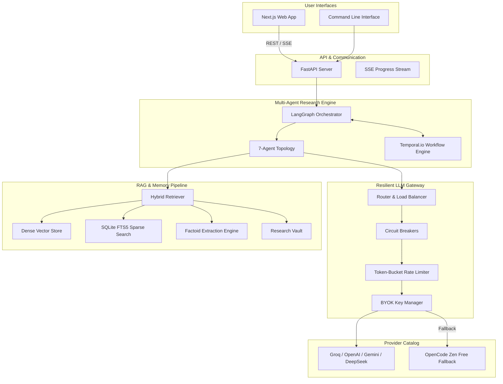

<div align="center">

# 🔬 Autonomous Research Agent

### *The Deep Multi-Agent Research Engine Powered by LangGraph, Temporal & Resilient BYOK Gateway*

[](https://python.org)
[](https://github.com/langchain-ai/langgraph)
[](https://temporal.io)
[](https://nextjs.org)
[](docs/PROVIDERS.md)
[](docs/IMPLEMENTATION_STATUS.md)

---

**An enterprise-grade autonomous research system that plans, searches, verifies, triangulates, and synthesizes cited research reports with live progress streaming, LaTeX math rendering, and 24-hour crash-resilient execution.**

*Works immediately out-of-the-box with **zero API key configuration** using the built-in free tier gateway fallback.*

---

[Key Differentiators](#-key-differentiators) •
[Quick Start](#-quick-start) •
[Architecture](#-architecture) •
[Research Modes](#-research-modes) •
[Documentation](#-documentation)

---

</div>

## 🌟 Key Differentiators

| Capability | Description | Benefit |
| :--- | :--- | :--- |
| 🤖 **7-Agent LangGraph Topology** | **Planner**, **Thinker**, **Researcher**, **Critic**, **Triangulator**, **Synthesizer**, & **Compiler** operating in coordinated feedback loops. | Eliminates single-prompt hallucinations through rigorous multi-agent verification. |
| ⚖️ **Adversarial Triangulation** | Deploys **Pro**, **Con**, and **Neutral** sub-agents in parallel, arbitrated by a **Synthesis Arbiter** that outputs a 0–10 bias score. | Uncovers hidden biases and synthesizes objective, balanced viewpoints on controversial queries. |
| ⚡ **Resilient BYOK Gateway** | Standard-library resilient LLM router with circuit breakers per endpoint, token-bucket rate limiters, retries with jitter, and automatic provider failover. | Fallback from paid APIs (Groq, OpenAI, Gemini, DeepSeek) to **OpenCode Zen Free Tier** with zero downtime. |
| 🧠 **Factoid RAG & Token Reduction** | Hybrid retrieval combining **Dense Vector Search**, **SQLite FTS5 Sparse Search**, and **Factoid Extraction**. | Compresses raw web dumps by **~90%** while boosting citation accuracy and reducing inference cost. |
| ⏳ **Durable Temporal.io Workflows** | Event-driven 24-hour research execution with state checkpointing, crash recovery, and human-in-the-loop approval gates. | Enables ultra-long research runs that survive network drops, API outages, and system restarts. |
| 🧮 **Native MathJax & LaTeX** | Automatic detection and sanitization of inline and block LaTeX expressions into rendered HTML and Markdown. | Renders mathematical proofs, scientific notation, and financial models accurately. |
| 🎨 **Next.js & FastAPI Interface** | Sleek ChatGPT-style Web UI with live Server-Sent Events (SSE) progress tracking, history management, and dark mode. | Delivers a premium, interactive user experience for research exploration. |

---

## ⚡ Quick Start

### 1. Installation

Requires **Python 3.14+** and [**uv**](https://docs.astral.sh/uv/) package manager.

```bash
# Clone the repository
git clone https://github.com/sarv-projects/Autonomous-Research-Agent.git
cd Autonomous-Research-Agent

# Run automated setup script
bash scripts/install.sh       # Linux / macOS
# or .\scripts\install.ps1     # Windows PowerShell
```

> **Note:** The agent works **immediately out-of-the-box** without any API keys by routing through the free OpenCode Zen tier!

---

### 2. Configuration (Optional)

To enable premium LLM providers or specialized search APIs, create a `.env` file:

```bash
cp .env.example .env
```

Key environment variables:

```ini
# Paid Provider Keys (Optional - falls back to free tier if omitted)
GROQ_API_KEY=gsk_...
OPENAI_API_KEY=sk-...
GEMINI_API_KEY=AIzaSy...
DEEPSEEK_API_KEY=sk-...

# Search Provider (Optional - falls back to built-in scraper & Wikipedia)
TAVILY_API_KEY=tvly-...
```

---

### 3. Usage Options

#### 🖥️ Web Interface (Recommended)

Start the FastAPI backend server:

```bash
uv run python main.py server
# API Docs available at http://localhost:8000/docs
```

In a second terminal, launch the Next.js frontend:

```bash
cd frontend
npm install
npm run dev
# Access the Web UI at http://localhost:3000
```

#### 💻 Command Line Interface (CLI)

```bash
# System Doctor — Verify gateway routes & tool readiness
uv run python main.py doctor

# Interactive Chat with memory
uv run python main.py chat

# Run Deep Autonomous Research
uv run python main.py research "Quantum Computing breakthroughs in 2026" --mode deep

# Execute Automated Evaluation Suite
uv run python main.py eval all

# Inspect Past Research History
uv run python main.py --history
```

---

## 🏗️ Architecture

### System Overview



---

### Multi-Agent Workflow Topology


---

## 🎯 Research Modes & Quality Dials

### Research Modes

Select the optimal depth and scope for your research task:

| Mode | Target Use Case | Iterations | Autonomy Level | Durable Execution |
| :--- | :--- | :---: | :---: | :---: |
| `chat` | Conversational Q&A with memory context | 1 | L0 | ❌ |
| `quick` | Surface-level fact finding & summary | 1–2 | L1 | ❌ |
| `standard` | Balanced technical & general research *(default)* | 3–4 | L1 | ❌ |
| `deep` | Thorough investigation with multi-wave verification | 5–6 | L2 | ❌ |
| `recency` | Focus on latest developments, news, & current events | 3 | L1 | ❌ |
| `academic` | Scholarly citations, methodology, & formal paper style | 4 | L2 | ❌ |
| `compare` | Multi-option technical or market comparison | 4 | L2 | ❌ |
| `ultra-long` | **24-hour durable execution** via Temporal.io | 10+ | L3 | ✅ |

### Quality Dials

Overlay quality presets to control reasoning depth and tool behavior:

- ⚡ **ultra-fast**: Speed optimized, minimal chunking.
- ⚖️ **balanced**: Standard depth with hybrid retrieval.
- 🎯 **accurate**: Enables Thinker contradiction checks and deeper claim extraction.
- 🔬 **comprehensive**: Enables full Thinker reasoning, Adversarial Triangulation, and Factoid compression.

---

## 📂 Project Structure

```
Autonomous-Research-Agent/
├── main.py                 # CLI & Web Server Entry Point
├── config/                 # Declarative YAML Configurations
│   ├── providers.yaml     # LLM Provider & Route Priority Catalog
│   └── modes.yaml         # Research Modes & Quality Dials
├── src/
│   ├── graph.py           # LangGraph Orchestration & Edge Logic
│   ├── state.py           # Research State TypedDict Schema
│   ├── llm.py             # Resilient Gateway Interface
│   ├── gateway/           # Resilient BYOK LLM Gateway
│   │   ├── router.py      # Request Routing & Failover Chains
│   │   ├── circuit.py     # Circuit Breakers (CLOSED/OPEN/HALF-OPEN)
│   │   ├── ratelimit.py   # Token-Bucket RPM/TPM & Concurrency Caps
│   │   ├── keys.py        # BYOK Virtual Key Manager & Accounting
│   │   ├── metrics.py     # Telemetry & Performance Metrics
│   │   └── providers.py   # REST Adapters for Providers
│   ├── engine/            # Multi-Agent Architecture
│   │   ├── agents/        # Planner, Thinker, Researcher, Critic, Triangulator, Synthesizer, Compiler
│   │   ├── temporal/      # Temporal.io Durable Workflows & Activities
│   │   ├── modes.py       # Mode & Budget Resolution
│   │   └── progress.py    # Progress Tracker & Event Streamer
│   ├── rag/               # Retrieval-Augmented Generation
│   │   ├── pipeline.py    # End-to-End Ingestion & Retrieval
│   │   ├── factoid.py     # Factoid Extraction & Token Compression
│   │   ├── guard.py       # Retriever Guard Source Quality Scorer
│   │   ├── hybrid.py      # Dense Vector + Sparse FTS5 Fusion
│   │   └── vault.py       # Persistent Cross-Session Source Cache
│   ├── tools/             # MCP Tool Bus & Discovery Registry
│   │   ├── executor.py    # Tool Execution Orchestrator
│   │   └── adapters/      # Built-in Scraper, Wikipedia, Tavily, Firecrawl
│   ├── render/            # LaTeX Math Sanitizer & MathJax HTML Renderer
│   ├── eval/              # Component & System Evaluation Framework
│   └── web/               # FastAPI REST API Backend
├── frontend/              # Modern Next.js 14 Web Interface
│   ├── app/               # Next.js Pages & App Router
│   └── components/        # Tailwind UI Components
├── docs/                  # System Specifications & Architecture Docs
└── reports/               # Output Directory for Generated Markdown & HTML Reports
```

---

## 🧪 Evaluation System

The repository includes a comprehensive, multi-tiered evaluation suite for assessing both isolated components and full agent trajectories:

```bash
# Run all component and system evaluations
uv run python main.py eval all

# Evaluate specific suites
uv run python main.py eval component
uv run python main.py eval system
```

**Evaluated Metrics:**
- **Component**: Tool selection accuracy, Plan coherence, Memory recall, RAG IR precision, Citation grounding.
- **System**: Task completion rate, Trajectory efficiency, Report quality scoring, Budget adherence.

---

## 📚 Documentation Index

| Document | Description |
| :--- | :--- |
| 📖 [**SPEC.md**](docs/SPEC.md) | Product requirements, core target specifications, and design goals. |
| 🏗️ [**ARCHITECTURE.md**](docs/ARCHITECTURE.md) | In-depth technical architecture, graph topology, and data flows. |
| 🚀 [**INSTALL.md**](docs/INSTALL.md) | Detailed installation, dependency management, and setup guide. |
| 🔌 [**PROVIDERS.md**](docs/PROVIDERS.md) | Provider catalog setup, API keys, pricing tables, and free tier options. |
| 📊 [**IMPLEMENTATION_STATUS.md**](docs/IMPLEMENTATION_STATUS.md) | Verification audit of implemented features vs specification targets. |
| 🧪 [**EVALS.md**](docs/EVALS.md) | Evaluation framework methodology, test benchmarks, and scoring metrics. |
| 🛡️ [**GATEWAY.md**](docs/GATEWAY.md) | Architecture specification for the Resilient BYOK LLM Gateway. |
| 🧩 [**FACTOID_PIPELINE.md**](docs/FACTOID_PIPELINE.md) | Deep dive into the ~90% token-reducing factoid extraction pipeline. |
| 🗺️ [**ROADMAP.md**](docs/ROADMAP.md) | Implementation phase status and upcoming feature roadmap. |

---

## 🤝 Contributing

Contributions are welcome! Please follow these steps:

1. Review [docs/ARCHITECTURE.md](docs/ARCHITECTURE.md) and [docs/ROADMAP.md](docs/ROADMAP.md).
2. Fork the repository and create a feature branch.
3. Ensure all tests pass: `uv run python test_gateway.py && uv run python main.py eval all`.
4. Submit a Pull Request with a clear description of your changes.

---

## 📄 License

This project is licensed under the MIT License - see the LICENSE file for details.
