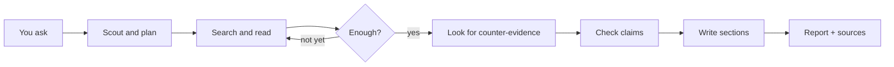

<div align="center">

# Providence

**Ask a question. Get a cited research report.**

A local deep-research agent: it searches the web, reads the pages, checks itself, and writes a report you can open as Markdown or HTML.

No API keys required to start. MIT licensed.

[](LICENSE)
[](https://python.org)
[](https://github.com/langchain-ai/langgraph)
[](https://fastapi.tiangolo.com)
[](https://nextjs.org)

[Install](#install) · [Usage](#usage) · [How it works](#how-it-works) · [Configuration](#configuration) · [Docs](#documentation)

</div>

---

You type a research question. Providence plans the work, searches, reads sources, looks for the other side of the argument, and writes a report.

Each report includes:

- the write-up, with `[1]` `[2]` style citations  
- **Evidence Bedrock** — short quotes and whether each claim looks supported  
- **Research Debt** — what it still could not nail down  
- **Sources** — links this run actually opened (not a invented bibliography)

**Who uses it**

| | |
|--|--|
| Students | First-pass literature review you can edit |
| Engineers | Stack / paper survey before you commit to a design |
| Analysts | Draft brief with real URLs to follow |
| Teams | Self-hosted research, keys stay on your machine |

It is a **drafting** tool, not a substitute for reading the sources.

---

## Install

You need [Python 3.10+](https://www.python.org/downloads/) and [uv](https://docs.astral.sh/uv/) (a fast Python package manager). The UI also needs [Node 18+](https://nodejs.org/) if you want the browser app.

**macOS / Linux**

```bash
git clone https://github.com/sarv-projects/providence.git
cd providence
bash scripts/install.sh

uv run python main.py doctor
uv run python main.py research "How do small language models compare to LLMs?" --mode standard
```

**Windows** (PowerShell)

```powershell
git clone https://github.com/sarv-projects/providence.git
cd providence
.\scripts\install.ps1

uv run python main.py doctor
uv run python main.py research "How do small language models compare to LLMs?" --mode standard
```

`doctor` tells you which models and search tools are ready. The report is written to `reports/` as `.md` and `.html`.

Web app (optional):

```bash
bash scripts/start-dev.sh
# browser → http://localhost:3000    API docs → http://localhost:8000/docs
```

First run works with **no** `.env` file. Writing uses [OpenCode Zen](https://opencode.ai/docs/zen/) free models. Search falls back to Wikipedia and a built-in scraper.

### Make it better (optional keys)

Copy `.env.example` to `.env` and add what you have:

| Key | Get it | Effect |
|-----|--------|--------|
| `GEMINI_API_KEY` | [Google AI Studio](https://aistudio.google.com/apikey) | Better planning / scout (free tier) |
| `EXA_API_KEY` | [Exa](https://exa.ai) | Much better web search — **recommended** |
| `FIRECRAWL_API_KEY` | [Firecrawl](https://firecrawl.dev) | Cleaner page extraction |
| `TAVILY_API_KEY` | [Tavily](https://tavily.com) | Extra search |
| `NEWSDATA_API_KEY` | [NewsData](https://newsdata.io) | Extra news |
| `EMBEDDING_API_KEY` | OpenAI embeddings | Better “find this again” in the vault |

Default cost: **$0**. You only pay if you add paid keys.

Full setup and Windows notes: [docs/INSTALL.md](docs/INSTALL.md).

---

## Usage

```bash
uv run python main.py doctor

uv run python main.py research "Your question" --mode standard
uv run python main.py research "Rust vs Go for backends" --mode compare
uv run python main.py research "Latest diffusion papers" --mode recency
uv run python main.py research "Quantum cryptography survey" --mode academic
uv run python main.py research "Quick facts on transformers" --mode quick

uv run python main.py chat          # conversation; long questions can start a research run
uv run python main.py server        # API on :8000
uv run python main.py --history     # past topics
```

Review the plan before it searches:

```bash
uv run python main.py research "topic" --mode deep --autonomy L2
```

### Pick a mode

| Mode | Use it when you want… | Time (free models) |
|------|------------------------|--------------------|
| `quick` | A short brief | ~1–3 min |
| `standard` | A normal report (default) | ~4–18 min |
| `deep` | Extra checking and both-sides write-up | longer |
| `academic` | Papers first (arXiv-heavy) | longer |
| `compare` | A vs B with a comparison table | mid |
| `recency` | What’s new this year | mid |
| `chat` | A conversation, not a file | seconds |
| `ultra-long` | A huge survey | hours |

**Autonomy:** `L1` just runs · `L2` you approve the outline first · `L3` unattended with a spend cap.

`deep` and `academic` keep Gemini in the loop after the first scout (if you set the key). `standard` still uses Gemini for the opening scout only.

---

## How it works

In one sentence: **Gemini thinks, Zen writes, Exa (or free search) reads the web.**

| Job | Who | Needs a key? |
|-----|-----|----------------|
| Planning / “thinker” | Gemini Flash | `GEMINI_API_KEY` (skipped gracefully if missing) |
| Writing the report | OpenCode Zen free | No |
| Finding pages | Exa, else Wikipedia + scraper | Exa recommended |



What you open at the end:

1. The report  
2. Evidence Bedrock — quotes and claim labels  
3. Research Debt — leftover unknowns  
4. Sources — this run’s URLs  

The compiler will not put a URL in Sources unless this run fetched it. That is the main integrity rule.

**Under the hood** (for engineers): LangGraph state machine in `src/graph.py`, FastAPI + SSE, Next.js UI, LanceDB + SQLite FTS5 with per-run isolation, gateway with retries and failover. See [docs/ARCHITECTURE.md](docs/ARCHITECTURE.md).

---

## Configuration

Edit `config/providers.yaml` to change models. Current defaults:

| | First choice | Then |
|--|--------------|------|
| Writing (`fast` / `strong`) | `nemotron-3-ultra-free` | other Zen free models |
| Thinking | `gemini-3.5-flash-lite` | other Gemini Flash IDs |

Zen endpoint: `https://opencode.ai/zen/v1/chat/completions` (no key on free models).  
Budgets and modes: `config/modes.yaml`.

---

## Results

[15-topic benchmark](benchmarks/RESEARCH_BENCHMARK.md) vs independently researched ground truth (Groq + Exa path used for that suite):

| Metric | Result |
|--------|--------|
| Fact-check | 86% (76 / 91) |
| Fake source lists shipped | 0 / 15 |
| Typical runtime | ~8 min |
| Largest report | ~48,000 words |

A later default-stack run (Zen free + Gemini scout, topic: SLMs vs LLMs) took ~18 minutes and listed 31 this-run sources.

---

## Project layout

```
main.py                 command line
config/                 modes and model list
src/graph.py            research pipeline
src/engine/agents/      planner, researcher, thinker, critic, writer
src/gateway/            retries, failover, rate limits
src/tools/              search and extract
src/rag/                local search index + vault
src/web/                HTTP API
frontend/               web UI
reports/                output files
```

---

## Documentation

| Doc | For |
|-----|-----|
| [Install](docs/INSTALL.md) | Setup problems, Windows, keys |
| [Architecture](docs/ARCHITECTURE.md) | Pipeline, agents, RAG |
| [Providers](docs/PROVIDERS.md) | Model endpoints and API keys |
| [Gateway](docs/GATEWAY.md) | Failover and metrics dashboard |
| [All docs](docs/INDEX.md) | Index |

---

## Development

```bash
uv run python main.py doctor
uv run python test_phase_c.py
uv run python test_gateway.py
uv run python main.py eval all
```

PRs welcome. Please keep “clone and run with no keys” working.

## License

[MIT](LICENSE) — use it at work, in class, or in a product. No copyleft.
